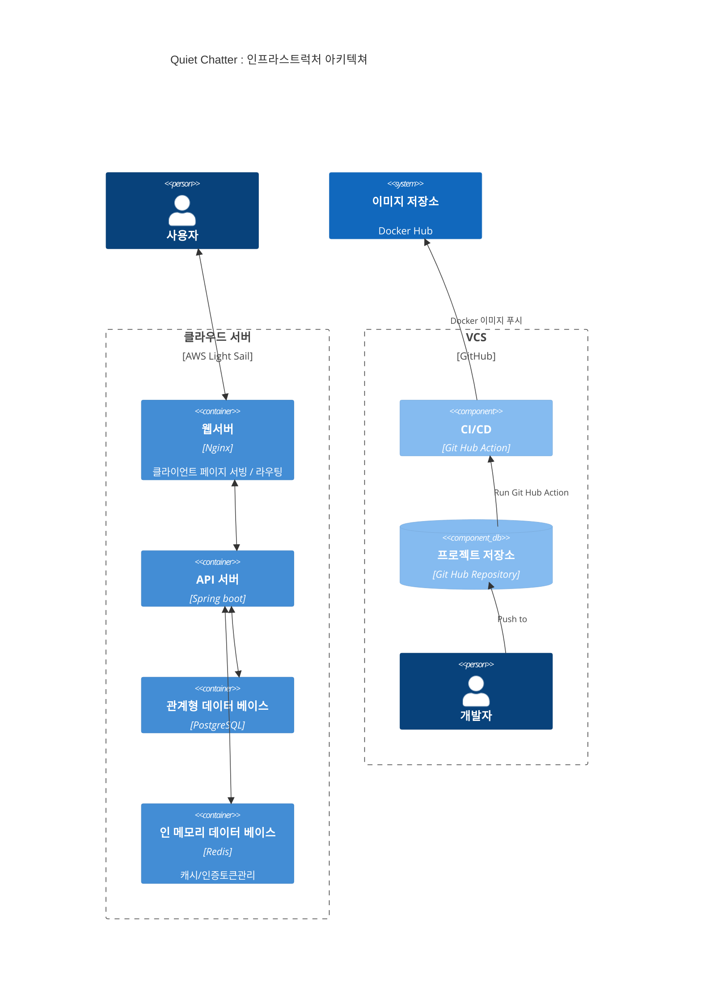
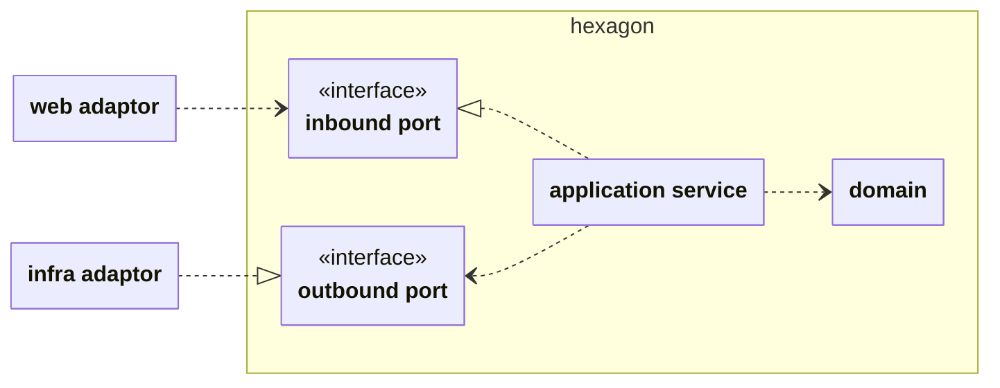

# Quiet Chatter: you belong here

URL: https://quiet-chatter.com

### 서비스 설명

이 서비스는 수줍은 사람들을 위한 독서나눔 서비스가 있으면 좋겠다고 생각해서 만들었습니다 :)  
로그인 없이 다른 분이 읽어봤으면 하는 책을 검색해서 북톡(BookTalk)으로 추천사 및 감상평을 남길 수 있고 좋아요나 공감하는 반응을 표현할 수 있습니다.

### 시작하게된 배경

> ∙∙∙ 나는 특정한 주제로 사람을 연결하는 일에 줄곧 흥미를 느껴왔다. 모임을 운영하며 나름의 보람이 있었지만 많은 사람들이 스스로의 능력을 과소평가하고 본인을 드러내기 쑥스러워 하는 까닭에 모임의 문턱 앞에서 돌아갔던 기억들이 여전히 마음 한켠에 숙제처럼 남아있다.
>
> 아마도 '나는 이곳에 어울리지 않아' 같은 내적인 속삭임으로 대변될 수 있을 그 마음들을 생각하면서, 이 문제를 해결하기 위한 과제로써 이번 오픈 미션을 시작해보면 좋겠다고 생각했다. 그리고 그 미션의 결과물이 '너는 이곳에 어울려' 라는 메세지를 전달해줄 수 있길 원했다.
>
> 그래서 나는 수줍음이 많은 사람들을 위한 독서 SNS 프로젝트를 생각했다 ∙∙∙   
> -[오픈미션 회고 중에서](/docs/old/2025년%20우테코%20지원%20오픈미션기록/오픈미션회고-정인호.pdf)-

### 주요 기능

- 개인정보 수집 없는 익명 활동
- 250자 짧은 추천사/감상평 : 북톡 (Book Talk)
- 일정 시간이 지나면 글 비공개 : 자동 숨김(Self-hidden)
- 조용한 리액션 : 👍좋아요, ❤️공감해요 (댓글 및 멘션 불가)

---

### 인프라스트럭처 아키텍쳐

  

### 애플리케이션 아키텍쳐 (Hexagonal Architecture)

