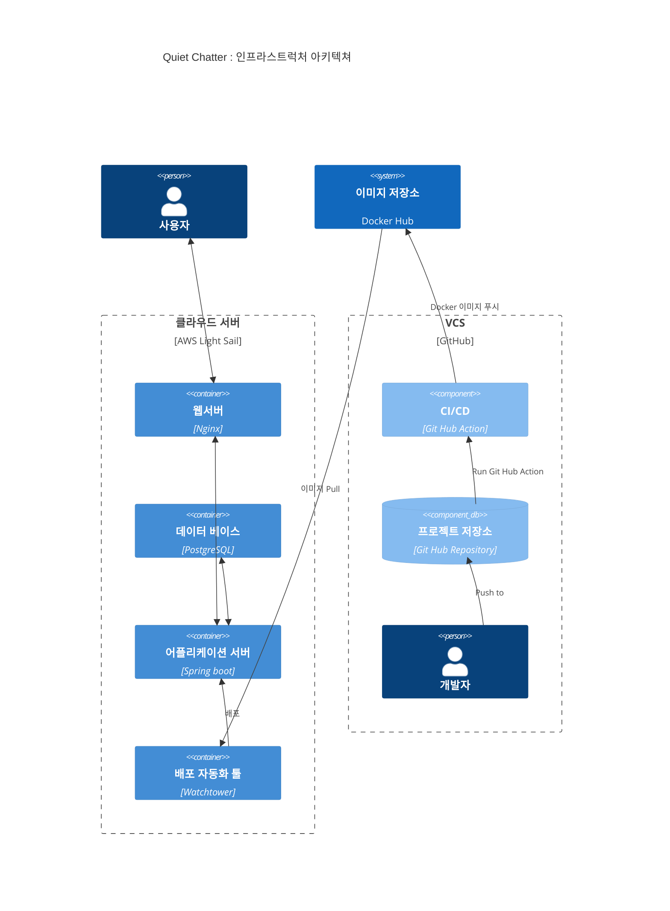
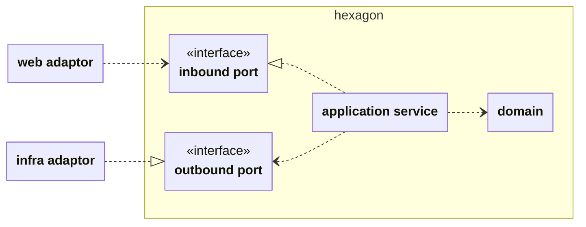

## 우아한테크코스(Woowa Tech Course) 웹 백엔드 8기 4-5주 차 프리코스 오픈미션 과제

### 오픈 미션: 프리코스 챌린지

문서 : [mission.md](docs/mission.md)

---

### 나의 오픈미션 목표

**목표:** 오픈미션 과제로 수줍은 사람들을 연결하기 위한 독서 SNS `Quiet Chatter`을 출시한다.

**제한 조건:**

- 지난 프리코스 [1주](/docs/development-guide/week-1-feedback.md), [2주](/docs/development-guide/week-2-feedback.md), [3주](/docs/development-guide/week-3-feedback.md)차 피드백을 준수한다. (아래 요약)
    - README.md와 기능 목록을 상세히 작성하고 업데이트한다, 커밋 메시지를 의미 있게 작성한다
    - Java에서 제공하는 API를 적극 활용한다. 연관성이 있는 상수는 static final 대신 enum을 활용한다
    - 오류를 찾을 때 출력 함수 대신 디버거를 사용한다, 공백을 의미 있게 사용한다, 의미 없는 주석을 달지 않는다, 이름을 통해 의도를 드러낸다, 이름에 자료형을 사용하거나 축약하지 않는다
    - 객체의 상태 접근을 제한한다, 데이터를 꺼내지(get)않고 일하도록 한다, 값을 하드 코딩하지 않는다,
    - 상수, 멤버 변수, 생성자, 메서드의 순서를 지킨다, 필드(인스턴스 변수)의 수를 줄이기 위해 노력한다
    - 메서드가 한 가지 기능만 수행하게 한다, 15라인이 넘지 않도록 구현한다
    - 테스트의 이유를 @DisplayName에 작성한다, 작은 단위의 테스트를 먼저 작성한다, 예외 케이스도 테스트한다
    - 테스트를 구현 코드에서 분리한다, 테스트가 어려운 코드를 쉽게 만든다
    - 지난 프리코스와 같이 [AngularJS Git Commit Message Conventions](https://gist.github.com/stephenparish/9941e89d80e2bc58a153), [Java Style Guide](/docs/development-guide/java_style_guide.md)을 준수한다.

**도전할 것**

- 스스로 지난 3주차 동안 배운 것을 적극 적용한다.
    - 도입할 기술에 대한 필요성을 적극적으로 고민한다.
    - 저수준의 도메인 모델을 집약하여 고수준의 도메인 모델을 만든다
    - 의존성을 인터페이스를 통해서 느슨하게 만든다, 계층사이의 의존의 방향이 외부(어댑터)에서 내부(도메인)으로 흐르게 정렬한다
    - 테스트 없는 프로덕트 코드를 지양한다. 테스트가 어려운 의존은 모킹하여 테스트한다, 외부 API나 확률을 모킹한다. 되도록 스프링 컨텍스트가 없는 가벼운 테스트를 작성할 수 있도록 최적화한다.
    - 원시값을 도메인 의미가 있는 값객체(Value Object)로 감싸서 사용한다. 필요한 경우 일급콜렉션 사용한다. 객체의 불변성과 가변성을 맥락에 맞도록 사용한다. 값-> 불변, 엔티티-> 가변

---

### 시작하게된 배경

> ∙∙∙ 나는 특정한 주제로 사람을 연결하는 일에 줄곧 흥미를 느껴왔다. 모임을 운영하며 나름의 보람이 있었지만 많은 사람들이 스스로의 능력을 과소평가하고 본인을 드러내기 쑥스러워 하는 까닭에 모임의 문턱 앞에서 돌아갔던 기억들이 여전히 마음 한켠에 숙제처럼 남아있다.
>
> 아마도 '나는 이곳에 어울리지 않아' 같은 내적인 속삭임으로 대변될 수 있을 그 마음들을 생각하면서, 이 문제를 해결하기 위한 과제로써 이번 오픈 미션을 시작해보면 좋겠다고 생각했다. 그리고 그 미션의 결과물이 '너는 이곳에 어울려' 라는 메세지를 전달해줄 수 있길 원했다.
>
> 그래서 나는 수줍음이 많은 사람들을 위한 독서 SNS 프로젝트를 생각했다 ∙∙∙   
> -오픈미션 회고 중에서-

### [오픈미션 회고](docs/오픈미션회고.md)

오픈미션 진행과정의 자세한 회고를 아래 문서에서 확인할 수 있습니다!

👉 [오픈미션 회고.md](docs/오픈미션회고.md)

---

# [Quiet Chatter : you belong here](https://quiet-chatter.com)

접속경로 : https://quiet-chatter.com


### 서비스 설명

이 서비스는 수줍은 사람들을 위한 독서나눔 서비스가 있으면 좋겠다고 생각해서 만들었습니다 :)  
로그인 없이 다른 분이 읽어봤으면 하는 책을 검색해서 북톡(BookTalk)으로 추천사 및 감상평을 남길 수 있고 좋아요나 공감하는 반응을 표현할 수 있습니다.

### 주요 기능

- 개인정보 수집 없는 익명 활동
- 250자 짧은 추천사/감상평 : 북톡 (Book Talk)
- 일정 시간이 지나면 글 비공개 : 자동 숨김(Self-hidden)
- 조용한 리액션 : 👍좋아요, ❤️공감해요 (댓글 및 멘션 불가)

### 이렇게 사용해보세요 :)


---

### 2월 스프린트 일정

- 01-30까지 : 지난 요구사항 문서화 , 기존 개발기능에 대한 문서화, 버전2 요구사항 정리, 테스크 도출, 스프린트 일정정리, 스프린트 시작
- 02-13까지 : 스프린트 일정에 맞춰, 준비-구현-회고 진행

### 요구사항 버전1

- [서비스의 모든 기능은 비 로그인 사용자의 접근을 허용한다](/docs/feature/비%20로그인%20사용자%20접근%20허용%20기능.md)
- [사용자는 키워드(제목, 저자 등)으로 책을 검색할 수 있다.](/docs/feature/도서%20검색%20기능.md)
- 각 사용자는 책에 댓글 형식의 톡을 작성, 수정, 삭제할 수 있다.
- 톡는 250자이내로 작성할 수 있다.
- [사용자는 톡에 반응할 수 있다. (좋아요, 공감해요)](/docs/feature/반응%20기능.md)
- 기본적으로 1년이 지난 톡은 비공개된다.
- [사용자는 다른 사람들이 작성한 톡을 추천받을 수 있다.](/docs/feature/톡%20추천%20기능.md)

### 버전 2용

- 사용자는 책의 저자를 찾을 수 있다.
- 사용자가 저자를 검색할때 저자의 책을 함께 확인할 수 있다.
- 사용자는 저자에 대해 톡을 작성할 수 있다.
- 무한스크롤

### 성능향상을 위한 내용

- [사용자 인증 정보를 캐싱하여 응답성 향상](/docs/feature/사용자%20인증%20정보%20캐싱.md)
- [반응(좋아요, 공감해요)에 지연처리로 응답성 향상](/docs/feature/반응%20지연%20처리%20기능.md)

### 각 요구사항의 구현에 해당되는 내용. 반영 필요

- HTTPS, 사용자 친화적 도메인주소로 접속가능하게 한다
- 추천 북톡 등 빈번한 조회 API의 응답성을 높인다 : 캐시전략 등
- 외부 도서 API를 사용하여 통합한다 : 네이버
- 모바일 접근성을 고려한 UI를 구현한다
- 확장성이 좋은 소프트웨어 구조를 사용한다 : 헥사고날 아키텍쳐

- 외부 공격을 막는 수단을 구축한다
  - 가용성 : 초당 API 제한

### 도메인

- 책 Book : ISBN, 제목, 출판사, 저자, 작성자의 속성을 가진다.
- 멤버 Member : 접속한 유저를 통칭. 게스트, 정회원, 어드민으로 나뉜다.
- 북톡 Talk : 250자이내로 작성, 숨김시간을 가진다.
- 리액션 Reaction : 북톡에대한 리액션이 가능하다. 좋아요, 공감해요
- 자동 숨김 Self Hidden : 기본적으로 1년이 지나면 글은 자동으로 숨김된다.

---
<br><br>

### 인프라스트럭처 아키텍쳐



<br><br>

### 애플리케이션 아키텍쳐 (Hexagonal Architecture)



<br><br>

### 패키지 구조

```text
├── java
│   └── maskun
│       └── quietchatter
│           ├── QuietChatterApplication.java
│           ├── book
│           │   ├── adaptor
│           │   │   ├── in
│           │   │   │   ├── BookApi.java
│           │   │   │   └── BookResponse.java
│           │   │   └── out
│           │   │       ├── NaverApiEnvironment.java
│           │   │       ├── NaverBookItem.java
│           │   │       ├── NaverBookSearchResponse.java
│           │   │       ├── NaverBookSearcher.java
│           │   │       ├── NaverConfig.java
│           │   ├── application
│           │   │   ├── BookQueryService.java
│           │   │   ├── in
│           │   │   │   ├── BookQueryable.java
│           │   │   │   └── Keyword.java
│           │   │   └── out
│           │   │       ├── BookRepository.java
│           │   │       └── ExternalBookSearcher.java
│           │   └── domain
│           │       ├── Author.java
│           │       ├── Book.java
│           │       ├── Description.java
│           │       ├── ExternalLink.java
│           │       ├── Isbn.java
│           │       ├── ThumbnailImage.java
│           │       └── Title.java
│           ├── customer
│           │   ├── adaptor
│           │   │   ├── in
│           │   │   │   └── CustomerMessageApi.java
│           │   │   └── out
│           │   ├── application
│           │   │   ├── CustomerMessageService.java
│           │   │   ├── in
│           │   │   │   └── CustomerMessageCreatable.java
│           │   │   └── out
│           │   │       └── CustomerMessageRepository.java
│           │   └── domain
│           │       ├── CustomerMessage.java
│           │       └── Message.java
│           ├── member
│           │   ├── adaptor
│           │   │   ├── in
│           │   │   └── out
│           │   ├── application
│           │   │   ├── MemberRegistrator.java
│           │   │   ├── in
│           │   │   │   └── GuestRegistrable.java
│           │   │   └── out
│           │   │       └── MemberRepository.java
│           │   └── domain
│           │       ├── Id.java
│           │       ├── Login.java
│           │       ├── Member.java
│           │       ├── Password.java
│           │       ├── Role.java
│           │       └── Status.java
│           ├── reaction
│           │   ├── adaptor
│           │   │   ├── in
│           │   │   │   ├── ReactionCommandApi.java
│           │   │   │   └── ReactionWebRequest.java
│           │   │   └── out
│           │   │       ├── Action.java
│           │   │       ├── ReactionBatchWorker.java
│           │   │       ├── ReactionEvent.java
│           │   │       ├── ReactionEventHandler.java
│           │   │       └── ReactionRequestAggregator.java
│           │   ├── application
│           │   │   ├── ReactionQueryService.java
│           │   │   ├── ReactionService.java
│           │   │   ├── in
│           │   │   │   ├── ReactionModifiable.java
│           │   │   │   ├── ReactionQueryable.java
│           │   │   │   └── ReactionTarget.java
│           │   │   └── out
│           │   │       ├── ReactionEventPublisher.java
│           │   │       └── ReactionRepository.java
│           │   └── domain
│           │       └── Reaction.java
│           ├── shared
│           │   ├── persistence
│           │   │   ├── BaseEntity.java
│           │   │   └── JpaConfig.java
│           │   ├── security
│           │   │   ├── AuthenticatedMemberToken.java
│           │   │   ├── GuestAuthenticationFilter.java
│           │   │   ├── GuestAuthenticationProvider.java
│           │   │   ├── GuestAuthenticationTokenProvider.java
│           │   │   ├── GuestPathMatcherProvider.java
│           │   │   ├── GuestPromotion.java
│           │   │   ├── MemberDetailService.java
│           │   │   ├── MemberDetails.java
│           │   │   └── SecurityConfig.java
│           │   └── web
│           │       ├── ErrorResponse.java
│           │       ├── IdResponse.java
│           │       ├── RestClientConfig.java
│           │       ├── WebConfig.java
│           │       └── WebExceptionHandler.java
│           ├── talk
│           │   ├── adaptor
│           │   │   ├── in
│           │   │   │   ├── RecommendTalkQueryApi.java
│           │   │   │   ├── TalkCommandApi.java
│           │   │   │   ├── TalkCreateWebRequest.java
│           │   │   │   ├── TalkQueryApi.java
│           │   │   │   └── TalkResponse.java
│           │   │   └── out
│           │   │       ├── CacheUpdateExecutorConfig.java
│           │   │       ├── RandomRecommendTalkMemory.java
│           │   │       └── RandomTalkSampler.java
│           │   ├── application
│           │   │   ├── TalkCreateService.java
│           │   │   ├── TalkQueryService.java
│           │   │   ├── in
│           │   │   │   ├── RecommendTalkQueryable.java
│           │   │   │   ├── RecommendTalks.java
│           │   │   │   ├── TalkCreatable.java
│           │   │   │   ├── TalkCreateRequest.java
│           │   │   │   ├── TalkQueryRequest.java
│           │   │   │   └── TalkQueryable.java
│           │   │   └── out
│           │   │       ├── RecommendTalkRepository.java
│           │   │       └── TalkRepository.java
│           │   └── domain
│           │       ├── Content.java
│           │       ├── ReactionCount.java
│           │       ├── Talk.java
│           │       └── Time.java
│           └── ui
│               └── UserInterfaceController.java
└── resources
    ├── application.yml
    ├── static
    │   ├── css
    │   │   └── style.css
    │   ├── images
    │   │   ├── quiet-chatter-icon.png
    │   │   ├── quiet-chatter-icon2.png
    │   │   └── 사용시연2.mp4
    │   └── js
    │       ├── api.js
    │       └── domain.js
    └── templates
        ├── book-detail.html
        ├── book-search-results.html
        ├── fragments
        │   ├── common-assets.html
        │   └── search.html
        └── home.html
