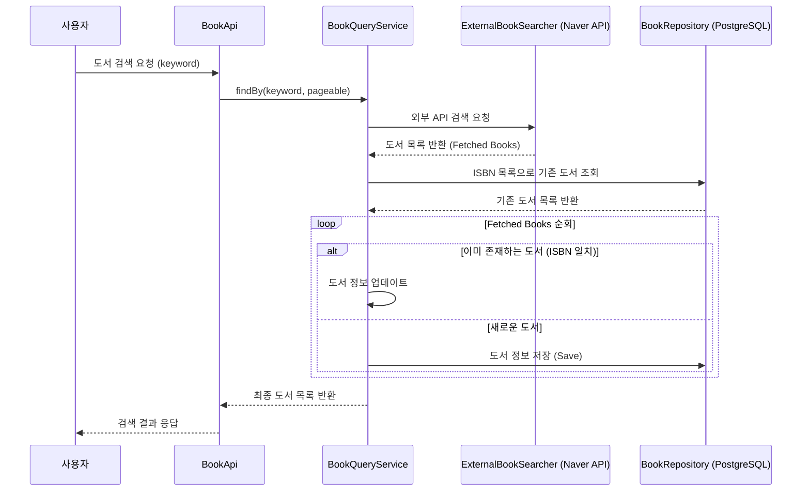

# 도서 검색 기능 (Book Search)

## 1. 개요

사용자가 제목, 저자 등의 키워드로 책을 검색할 수 있는 기능입니다. 외부 도서 검색 API를 연동하여 실시간으로 도서 정보를 제공하며, 검색된 도서는 시스템 내부에 자동으로 등록되어 북톡(Talk) 작성 및 조회에 활용됩니다.

## 2. 검색 흐름 도식화 (Mermaid)

## 3. 상세 구현 분석

### 3.1. 외부 API 연동 및 추상화

- `ExternalBookSearcher` 인터페이스를 통해 외부 도서 검색 엔진을 추상화했습니다.
- 현재는 네이버 도서 검색 API(`NaverBookSearcher`)를 구현체로 사용하고 있으며, 향후 카카오나 구글 도서 API로 손쉽게 교체 가능하도록 설계되었습니다.

### 3.2. 데이터 정합성 및 영속화 전략

- **ISBN 기반 식별**: 도서의 고유 식별자인 ISBN을 사용하여 중복 등록을 방지합니다.
- **Merge or Persist**:
    - 검색 결과 중 이미 DB에 존재하는 도서는 최신 정보(제목, 설명, 썸네일 등)로 업데이트합니다.
    - DB에 없는 새로운 도서는 자동으로 저장되어, 사용자가 즉시 해당 도서에 대한 북톡을 남길 수 있는 상태로 만듭니다.

### 3.3. 도메인 중심 설계

- 외부 API의 복잡한 응답 구조를 도메인 객체인 `Book`과 VO(`Title`, `Isbn`, `Author` 등)로 변환하여 처리합니다.
- 이를 통해 외부 시스템의 변경이 내부 비즈니스 로직에 미치는 영향을 최소화합니다.

## 4. 기대 효과

- **데이터 풍부성**: 자체 구축한 데이터베이스에 한정되지 않고 방대한 외부 도서 데이터를 활용할 수 있습니다.
- **사용자 편의성**: 별도의 도서 등록 절차 없이 검색만으로 즉시 서비스를 이용할 수 있습니다.
