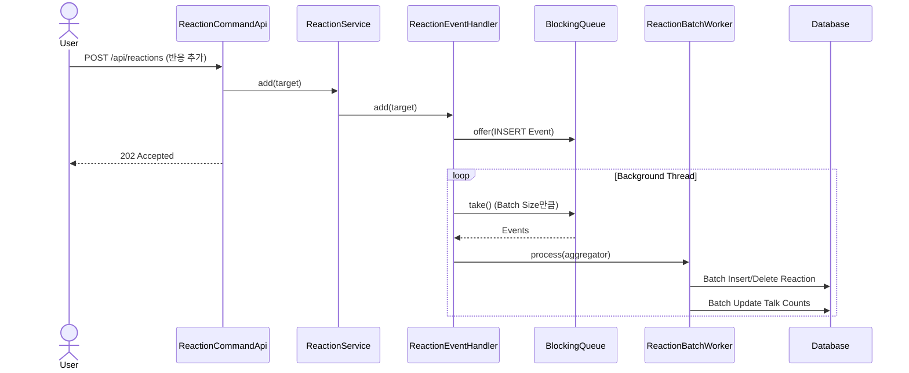

# 반응 기능

## 요구사항

- 사용자는 톡에 반응할 수 있다. (좋아요, 공감해요)
- 사용자는 톡에 대한 반응을 취소할 수 있다.
- 반응은 댓글이나 멘션이 불가능한 조용한 리액션이다.
- 반응 처리는 지연 처리를 통해 응답성을 향상시킨다.

## 구현개요

반응 기능은 `Reaction` 도메인을 중심으로 구현되었습니다. 사용자의 반응 요청(추가/삭제)은 즉시 DB에 반영되지 않고, 메모리 큐(`BlockingQueue`)에 저장된 후 별도의 스레드(`ReactionEventHandler`)에 의해 배치 처리됩니다. 이를 통해 대량의 트래픽에도 빠른 응답성을 보장합니다.

- **도메인**: `Reaction` 엔티티는 `talkId`, `memberId`, `type`(LIKE, SUPPORT)을 가집니다.
- **애플리케이션**: `ReactionService`는 `ReactionEventPublisher`를 통해 이벤트를 발행합니다.
- **어댑터(In)**: `ReactionCommandApi`는 HTTP 요청을 받아 서비스를 호출합니다.
- **어댑터(Out)**:
    - `ReactionEventHandler`: 이벤트를 큐에 쌓고 배치 단위로 처리합니다.
    - `ReactionBatchWorker`: `JdbcTemplate`을 사용하여 배치 삽입/삭제 및 `Talk` 테이블의 카운트 업데이트를 수행합니다.
    - `ReactionRequestAggregator`: 큐에서 꺼낸 이벤트 중 상쇄되는 작업(추가 후 즉시 삭제 등)을 필터링합니다.

## 다이어그램

## 상세구현내용

### 1. 도메인 모델 (`Reaction`)
- `Reaction`은 `talkId`, `memberId`, `type`의 조합으로 유니크 제약조건을 가집니다.
- `Type`은 `LIKE`(좋아요), `SUPPORT`(공감해요) 두 가지입니다.

### 2. 비동기 배치 처리 (`ReactionEventHandler`)
- `LinkedBlockingQueue`를 사용하여 이벤트를 버퍼링합니다.
- 별도의 데몬 스레드가 큐에서 이벤트를 꺼내 배치 단위로 처리합니다.
- 애플리케이션 종료 시(`ContextClosedEvent`) 남은 이벤트를 모두 처리하고 종료합니다.

### 3. 배치 작업 최적화 (`ReactionBatchWorker`, `ReactionRequestAggregator`)
- `ReactionRequestAggregator`는 배치 내에서 동일한 타겟에 대한 중복 요청을 상쇄(예: 추가 -> 삭제 -> 추가 => 추가)하여 DB 부하를 줄입니다.
- `ReactionBatchWorker`는 `JdbcTemplate.batchUpdate`를 사용하여 대량의 데이터를 효율적으로 처리합니다.
- `Talk` 테이블의 `like_count`, `support_count`를 한 번의 쿼리로 업데이트하여 동시성 문제를 완화하고 성능을 높입니다.

### 4. API 엔드포인트
- `POST /api/reactions`: 반응 추가
- `DELETE /api/reactions`: 반응 삭제
- 두 API 모두 비동기 처리를 암시하는 `202 Accepted`를 반환합니다.
