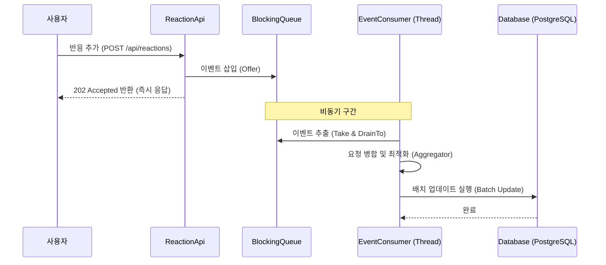

# 반응 지연 처리 기능 (Reaction Write-Behind)

## 1. 개요

좋아요, 공감해요와 같은 반응 기능은 사용자 인터랙션이 매우 빈번하게 발생하는 영역입니다. 매 요청마다 데이터베이스에 직접 쓰기 작업을 수행하는 대신, 메모리 큐를 활용한 비동기 배치 처리(Write-Behind) 방식을 도입하여 시스템의 응답성을 높이고 데이터베이스 부하를 최소화했습니다.

## 2. 반응 처리 흐름 도식화 (Mermaid)

## 3. 상세 구현 분석

### 3.1. 비동기 이벤트 기반 아키텍처

- **즉시 응답**: 사용자의 요청이 들어오면 최소한의 유효성 검사(대상 존재 여부 등)만 수행한 후 이벤트를 큐에 넣고 즉시 `202 Accepted` 응답을 보냅니다.
- **생산자-소비자 패턴**: `ReactionEventHandler`가 이벤트를 수집하고, 별도의 전용 스레드(`reaction-event-consumer`)가 이를 소비하여 처리합니다.

### 3.2. 요청 병합 및 최적화 (Aggregation)

- **중복 제거**: 배치 단위(기본 100개)로 이벤트를 모으는 과정에서 `ReactionRequestAggregator`가 작동합니다.
- **최종 상태 반영**: 예를 들어 한 사용자가 1초 내에 '좋아요'를 눌렀다 취소한 경우, 두 이벤트를 상쇄하여 DB에는 아무런 쿼리도 보내지 않습니다. 이는 불필요한 I/O를 획기적으로 줄여줍니다.

### 3.3. 배치 쓰기 (Batch Worker)

- **효율적인 I/O**: 개별 쿼리를 여러 번 실행하는 대신, 모여진 데이터를 바탕으로 배치 쿼리를 실행하여 데이터베이스 커넥션 점유 시간을 줄입니다.

### 3.4. Graceful Shutdown

- 애플리케이션이 종료될 때(`ContextClosedEvent`), 큐에 남아 있는 모든 이벤트를 즉시 DB에 반영한 후 종료되도록 설계되어 데이터 유실을 방지합니다.

## 4. 기대 효과

- **사용자 경험 향상**: DB 작업 완료를 기다리지 않으므로 네트워크 지연을 제외하면 즉각적인 응답을 체감할 수 있습니다.
- **시스템 안정성**: 갑작스러운 트래픽 증가(이벤트 발생)에도 DB가 직접적인 타격을 받지 않고 큐를 통해 완충 작용을 합니다.
- **자원 효율성**: DB 커넥션 풀의 효율적인 사용과 I/O 비용 감소로 더 많은 동시 접속자를 수용할 수 있습니다.
