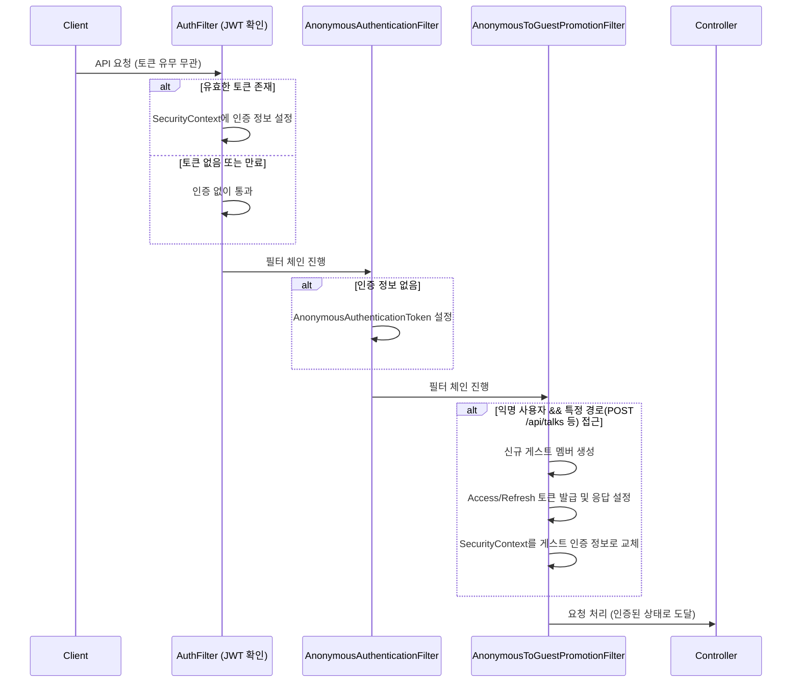

# 비 로그인 사용자 접근 허용 (Non-logged-in User Access)

## 1. 개요

Quiet Chatter는 사용자가 별도의 로그인 절차 없이도 서비스의 모든 기능을 이용할 수 있도록 설계되었습니다. 이를 위해 인증되지 않은 사용자가 특정 액션(글 작성, 반응 등)을 수행할 때 시스템이 자동으로 '게스트(Guest)' 계정을 생성하고 인증 토큰을 발급하는 **자동 게스트 승급(Anonymous to Guest Promotion)** 메커니즘을 사용합니다.

## 2. 인증 흐름 도식화 (Mermaid)

## 3. 상세 구현 분석

### 3.1. 전역 접근 허용 (`SecurityConfig`)

`SecurityConfig`에서 `.authorizeHttpRequests(auth -> auth.anyRequest().permitAll())` 설정을 통해 모든 API 경로에 대해 기본적으로 접근을 허용합니다.

### 3.2. 투명한 인증 처리 (`AuthFilter`)

- 요청 헤더나 쿠키에서 Access Token을 추출하여 인증을 시도합니다.
- 토큰이 만료된 경우 Refresh Token을 사용하여 자동으로 토큰을 갱신합니다.
- 토큰이 없더라도 요청을 차단하지 않고 다음 필터로 넘깁니다.

### 3.3. 자동 게스트 승급 (`AnonymousToGuestPromotionFilter`)

이 기능의 핵심으로, 사용자가 명시적으로 로그인하지 않았을 때 "식별 가능한 사용자"로 전환해주는 역할을 합니다.

- **대상 경로**: 현재 `POST /api/talks`, `POST /api/reactions`, `DELETE /api/reactions` 등 데이터 변경이 일어나는 주요 경로를 대상으로 합니다.
- **작동 조건**: 현재 `SecurityContext`의 인증 정보가 `AnonymousAuthenticationToken`인 경우(즉, 유효한 토큰이 없는 경우)에만 작동합니다.
- **수행 작업**:
    1. `AuthMemberService`를 통해 새로운 게스트 멤버를 DB에 생성합니다.
    2. 생성된 게스트 정보를 바탕으로 JWT(Access/Refresh)를 생성하여 응답(Response)에 포함시킵니다.
    3. 현재 요청의 인증 정보를 새로 생성된 게스트로 교체하여, 이후 컨트롤러 로직에서 사용자 ID를 정상적으로 참조할 수 있게 합니다.

## 4. 기대 효과

- **사용자 경험 향상**: 가입 절차 없이 즉시 서비스를 이용할 수 있어 진입 장벽이 낮아집니다.
- **데이터 일관성**: 비 로그인 사용자도 시스템 내부적으로는 '게스트'라는 멤버로 관리되므로, 작성자 식별이나 반응 집계 등의 로직을 로그인 사용자와 동일하게 유지할 수 있습니다.
