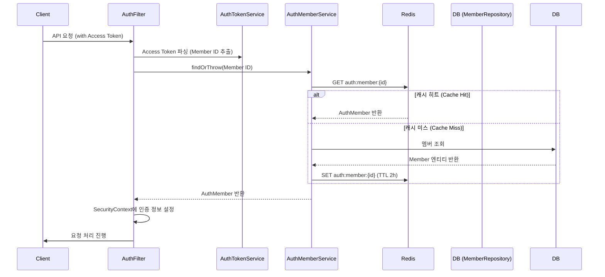

# 사용자 인증 정보 캐싱 (Authentication Caching)

## 1. 개요

매 요청마다 발생하는 사용자 인증 과정에서 데이터베이스(PostgreSQL) 조회를 최소화하기 위해 Redis를 활용한 캐싱 계층을 도입했습니다. 이를 통해 API 응답 속도를 개선하고 데이터베이스의 부하를 줄여 전체적인 시스템 성능을 향상시킵니다.

## 2. 인증 흐름 도식화 (Mermaid)

## 3. 상세 구현 분석

### 3.1. AuthMember 캐싱 전략

- **대상**: `AuthMember` (사용자 ID 및 권한 정보)
- **패턴**: Look-aside (Cache Aside) 패턴을 사용합니다.
- **저장소**: Redis (`auth:member:{id}` 키 형식 사용)
- **만료 정책**: 캐시 데이터는 2시간(`Duration.ofHours(2)`) 동안 유지됩니다. 이는 빈번한 DB 접근을 막으면서도, 권한 변경 등의 정보가 너무 오래 지연되지 않도록 균형을 맞춘 설정입니다.

### 3.2. 토큰 기반 세션 관리

- **Refresh Token 매핑**: `AuthTokenService`는 Refresh Token ID와 Member ID의 매핑 정보를 Redis에 저장합니다. (`auth:refresh-token:{tokenId}`)
- **성능 이점**: 토큰 갱신(Refresh) 요청 시 DB를 조회하지 않고 Redis 확인만으로 새로운 Access Token을 발급할 수 있어 매우 빠른 처리가 가능합니다.

### 3.3. 데이터 직렬화

- Redis에 저장되는 데이터는 JSON 형태로 직렬화되어 저장됩니다. 이는 디버깅이 용이하고, 향후 서비스 확장 시 다른 언어나 플랫폼에서도 캐시 데이터를 참조하기 쉽게 만듭니다.

## 4. 기대 효과

- **응답 시간 단축**: 네트워크 레이턴시가 낮은 Redis를 사용함으로써 인증에 소요되는 시간을 밀리초(ms) 단위 이하로 단축합니다.
- **DB 부하 감소**: 전체 요청의 상당 부분을 차지하는 인증용 조회 쿼리를 캐시가 처리함으로써, DB는 비즈니스 로직 처리에 더 많은 자원을 할당할 수 있습니다.
