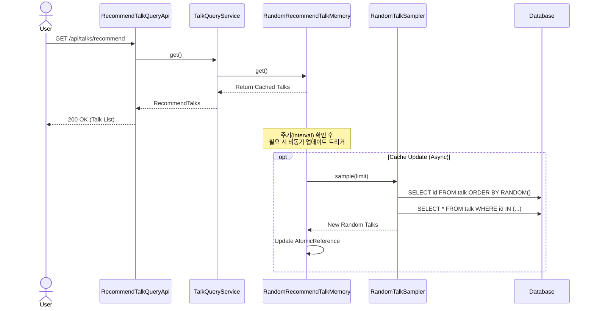

# 톡 추천 기능

## 요구사항

- 사용자는 다른 사람들이 작성한 톡을 추천받을 수 있다.
- 추천되는 톡은 무작위로 선정되어 사용자에게 노출된다.
- 빈번한 조회 요청에 대응하기 위해 캐싱 전략을 사용하여 응답성을 높인다.
- 캐시는 일정 주기마다 비동기적으로 업데이트되어 최신성을 유지한다.

## 구현개요

톡 추천 기능은 데이터베이스에서 무작위로 톡을 추출하여 메모리에 캐싱하고, 사용자에게 제공하는 방식으로 구현되었습니다. `RandomRecommendTalkMemory`가 캐시 관리의 핵심 역할을 수행하며, `Write-Behind`와 유사한 비동기 업데이트 전략을 사용합니다.

- **도메인**: `Talk` 도메인을 그대로 활용하며, 추천 목록을 표현하는 `RecommendTalks` 일급 컬렉션을 사용합니다.
- **애플리케이션**: `TalkQueryService`는 `RecommendTalkQueryable` 인터페이스를 통해 추천 톡 목록을 조회합니다.
- **어댑터(In)**: `RecommendTalkQueryApi`는 `/api/talks/recommend` 엔드포인트를 통해 추천 목록을 반환합니다.
- **어댑터(Out)**:
    - `RandomRecommendTalkMemory`: 추천 톡 목록을 메모리에 저장하고 관리합니다. `AtomicReference`를 사용하여 스레드 안전성을 확보하고, 설정된 주기(`interval-ms`)가 지나면 비동기적으로 캐시를 갱신합니다.
    - `RandomTalkSampler`: `JdbcTemplate`을 사용하여 DB에서 `ORDER BY RANDOM()` 쿼리로 무작위 ID를 추출한 후, 해당 톡들을 조회합니다.

## 다이어그램

## 상세구현내용

### 1. 메모리 캐싱 전략 (`RandomRecommendTalkMemory`)
- **AtomicReference**: `cachedTalks`와 `lastUpdatedAt`을 `AtomicReference`로 관리하여 락 없이 안전하게 상태를 업데이트합니다.
- **Lazy Update**: 사용자의 조회 요청 시점에 마지막 업데이트 시간을 확인합니다. 설정된 주기(기본 5초)가 지났다면 `ThreadPoolTaskExecutor`를 통해 비동기적으로 업데이트 작업을 제출합니다.
- **Non-Blocking**: 업데이트 중에도 사용자는 기존에 캐싱된 데이터를 즉시 응답받으므로 지연 시간이 거의 발생하지 않습니다.

### 2. 무작위 샘플링 (`RandomTalkSampler`)
- 효율적인 무작위 추출을 위해 먼저 `ORDER BY RANDOM()` 쿼리로 ID 목록만 가져온 후, JPA의 `findAllByIdIn`을 사용하여 엔티티를 조회합니다.
- 이는 전체 데이터를 메모리에 올리지 않고도 무작위성을 확보할 수 있는 방식입니다.

### 3. 비동기 업데이트 실행기 (`CacheUpdateExecutorConfig`)
- 캐시 업데이트 작업이 메인 스레드나 요청 처리 스레드를 방해하지 않도록 별도의 스레드 풀(`cacheUpdateExecutor`)을 정의하여 사용합니다.

### 4. API 엔드포인트
- `GET /api/talks/recommend`: 현재 메모리에 캐싱된 추천 톡 목록을 반환합니다.
