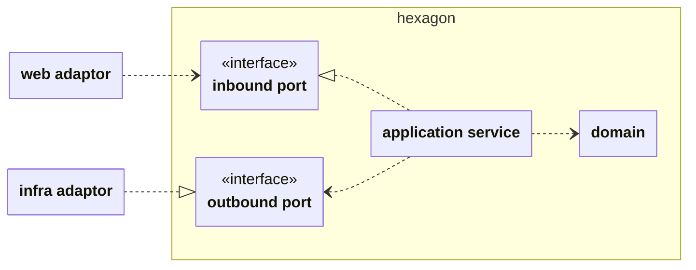

# 애플리케이션 아키텍쳐 가이드 Application Architecture guide

본 프로젝트는 **헥사고날 아키텍처(Hexagonal Architecture, Ports and Adapters)** 를 기반으로 설계되었습니다.
비즈니스 로직의 순수성을 보존하고, 외부 기술의 변경이 도메인 로직에 영향을 주지 않도록 격리하는 것을 목표로 합니다.

---

## 도메인 중심의 패키지 구조

루트 경로 아래에 도메인 별로 최상위 패키지가 분리되어 있습니다. 예시는 다음과 같습니다.

- book: 도서 정보 관리 및 검색 관련 도메인
- talk: 채팅 및 대화방 관련 도메인
- member: 회원 관리 및 프로필 관련 도메인
- reaction: 좋아요, 댓글 등 반응 관련 도메인
- security: 인증/인가 및 보안 관련 설정
- shared: 여러 도메인에서 공통으로 사용하는 유틸리티 및 설정

### 도메인 패키지의 내부 예시 (book 패키지)

각 도메인 패키지는 헥사고날 아키텍처의 계층에 따라 다음과 같이 구성됩니다.

```text
book
├── adaptor           # 어댑터 계층 (외부와의 통신)
│   ├── inbound       # Web Controller 등
│   └── outbound      # JPA Repository, 외부 API 클라이언트 등
├── application       # 응용 계층 (유스케이스)
│   ├── port          # Inbound/Outbound 인터페이스
│   └── service       # 비즈니스 로직 구현체
└── domain            # 도메인 계층 (핵심 로직) Entity, VO
```

### 패키지 접근제한자 사용

노출이 필요한 경우를 제외하고 기본적으로 default(package private) 접근제한자를 클래스에 사용합니다.

이 방식은 공개 범위를 줄이고 의존성이 낮은 설계를 유지하기 위함입니다.

## 핵심 원칙: 의존성 방향 (Dependency Rule)

가장 중요한 원칙은 **"모든 의존성은 외부에서 내부로 향해야 한다"** 입니다.

- **내부 (Domain)** 는 **외부 (Web, DB)** 에 대해 전혀 알지 못합니다.
- 외부 계층의 변경(예: RDBMS 교체, UI 변경)은 내부 도메인 로직에 영향을 주지 않습니다.
- 소스 코드의 의존성 화살표는 항상 `Adaptor -> Application -> Domain` 방향으로 흐릅니다.

---

## 계층별 역할 (Layered Structure)

### 1. 도메인 계층 (Domain Layer)

비즈니스 로직의 핵심입니다. 엔티티(Entity), 값 객체(VO), 도메인 규칙이 이곳에 존재합니다.

POJO를 지향하지만 개발의 편의성을 위해서 Spring Date JPA만을 제한적으로 의존합니다.

### 2. 응용 계층 (Application Layer)

애플리케이션의 유스케이스(Use Case)를 담당합니다. 도메인 객체를 사용하여 사용자의 요구사항을 처리합니다.

외부와 소통하기 위한 Ports (인터페이스)가 정의됩니다.

- **Inbound Port**: 외부에서 내부로 들어오는 요청을 위한 인터페이스 (e.g., `...Queryable`, `...Creatable`)
- **Outbound Port**: 내부에서 외부로 나가는 요청을 위한 인터페이스 (e.g., `...Repository`, `...Searcher`)

### 3. 어댑터 계층 (Adaptor Layer)

애플리케이션을 외부 세계와 연결합니다.

- **Inbound Adaptor**: 웹 요청(HTTP)을 받아 응용 계층의 Inbound Port를 호출합니다 (e.g., Controller).
- **Outbound Adaptor**: 응용 계층의 Outbound Port를 구현하여 실제 DB나 외부 API와 통신합니다 (e.g., JpaRepository 구현체, NaverBookApi).

---

## 애플리케이션 아키텍쳐 다이어그램 (Hexagonal Architecture)



