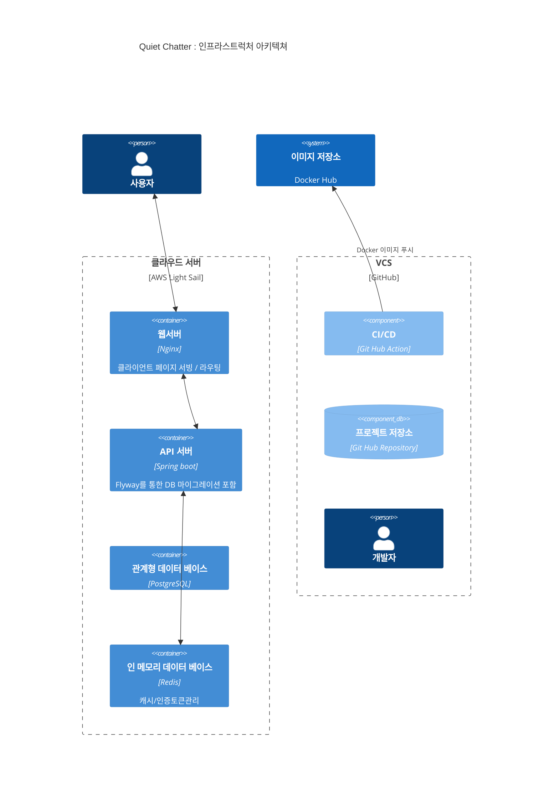

# 인프라스트럭처 아키텍쳐

## 스테이징 전략 (Staging Strategy)

### Production (운영)
- **도메인 (API)**: `api.quiet-chatter.com`
- **도메인 (Frontend)**: `quiet-chatter.com`
- **Docker 이미지**: `maskun2/quiet-chatter:latest`
- **데이터베이스**: PostgreSQL (`quiet_chatter`), Redis (DB 0)
- **배포**: `main` 브랜치 푸시 시 GitHub Actions를 통해 자동 배포

### Development (개발)
- **도메인 (API)**: `dev-api.quiet-chatter.com`
- **도메인 (Frontend)**: `dev.quiet-chatter.com`
- **Docker 이미지**: `maskun2/quiet-chatter-dev:latest`
- **데이터베이스**: PostgreSQL (`quiet_chatter_dev`), Redis (DB 1)
- **배포**: `dev` 브랜치 푸시 시 GitHub Actions를 통해 자동 배포

## 배포 파이프라인 (CI/CD)
1. GitHub 푸시 감지 (`main` 또는 `dev`)
2. Gradle 빌드 및 테스트 수행
3. Docker 이미지 빌드 및 Docker Hub 푸시
4. 서버(AWS Lightsail)의 Watchtower가 새 이미지를 감지하여 컨테이너 재시작
