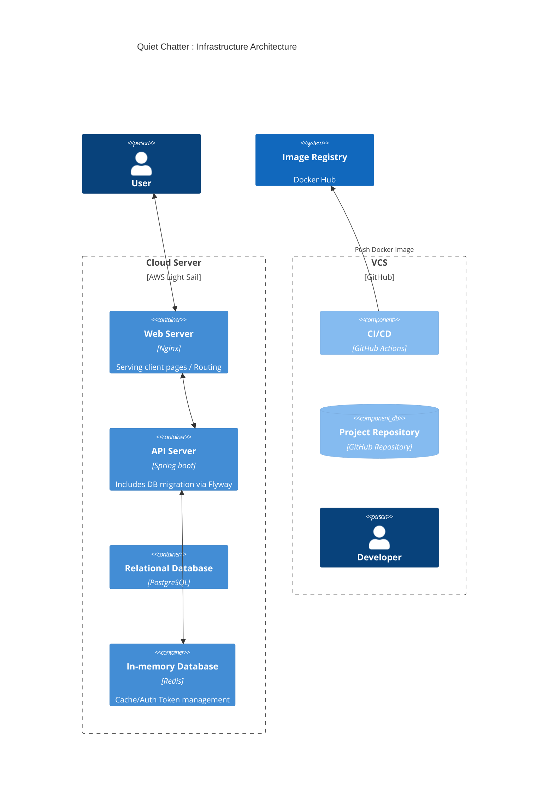
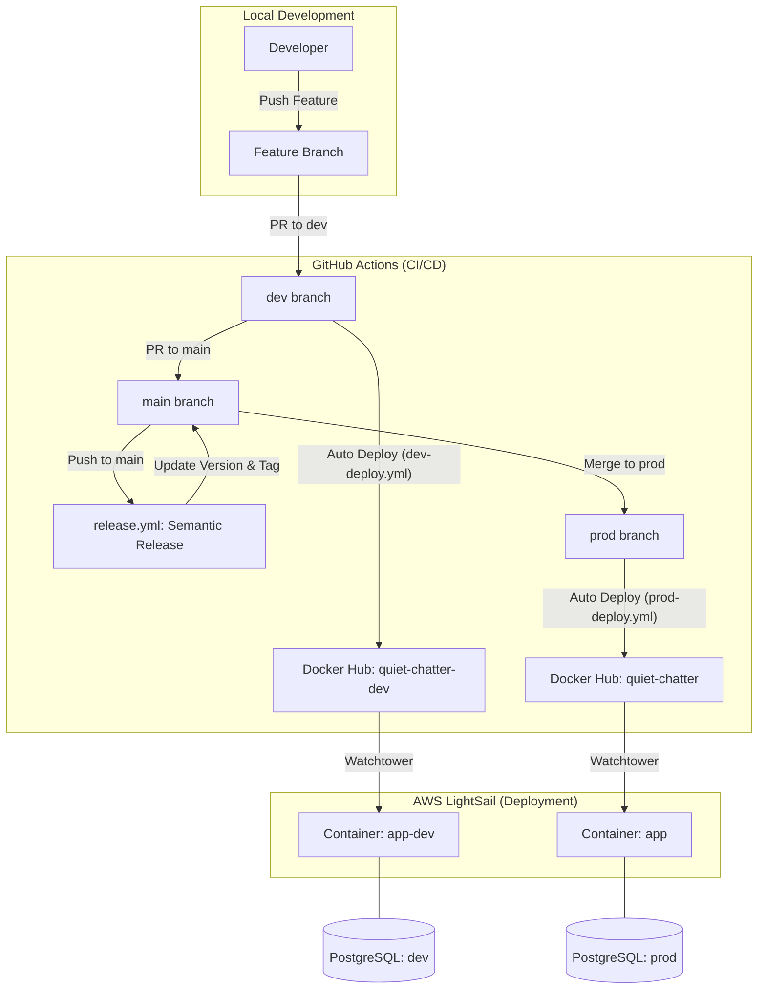

# Infrastructure Architecture

## Staging Strategy

### Production
- **Domain (API)**: `api.quiet-chatter.com`
- **Domain (Frontend)**: `quiet-chatter.com`
- **Docker Image**: `maskun2/quiet-chatter:latest`
- **Database**: PostgreSQL, Redis (DB 0)
- **Release Trigger**: `Semantic Release` runs when pushing/merging to `main` (updates version, creates tags, manages CHANGELOG).
- **Deployment Trigger**: Auto-deploy when pushing/merging to `prod` (detected by Watchtower).

### Development
- **Domain (API)**: `dev-api.quiet-chatter.com`
- **Domain (Frontend)**: `dev.quiet-chatter.com`
- **Docker Image**: `maskun2/quiet-chatter-dev:latest`
- **Database**: PostgreSQL, Redis (DB 1)
- **Deployment Trigger**: Auto-deploy when pushing to `dev` (detected by Watchtower).

## Deployment & Release Pipeline (CI/CD)

### 1. Development Server
1. Push to `dev` branch is detected.
2. Gradle build and tests run (including `testDocs`).
3. Build `quiet-chatter-dev` Docker image and push to Docker Hub.
4. **Watchtower** detects the new image and restarts the dev server container automatically.

### 2. Release & Production Server
1. **Release Management**: `release.yml` runs when merging to `main`.
    - Analyzes commit messages to decide the next version.
    - Updates version in `build.gradle` and creates `CHANGELOG.md`.
    - Issues a Git tag and creates a GitHub Release.
2. **Production Deployment**: `prod-deploy.yml` runs when pushing/merging to `prod`.
    - Gradle build (skips tests) and auto-generates `openapi3.json`.
    - Build `quiet-chatter` Docker image and push to Docker Hub.
3. **Watchtower** detects the new image on the production server and restarts the container.

---

## Infrastructure Architecture Diagram (Staging Flow)

