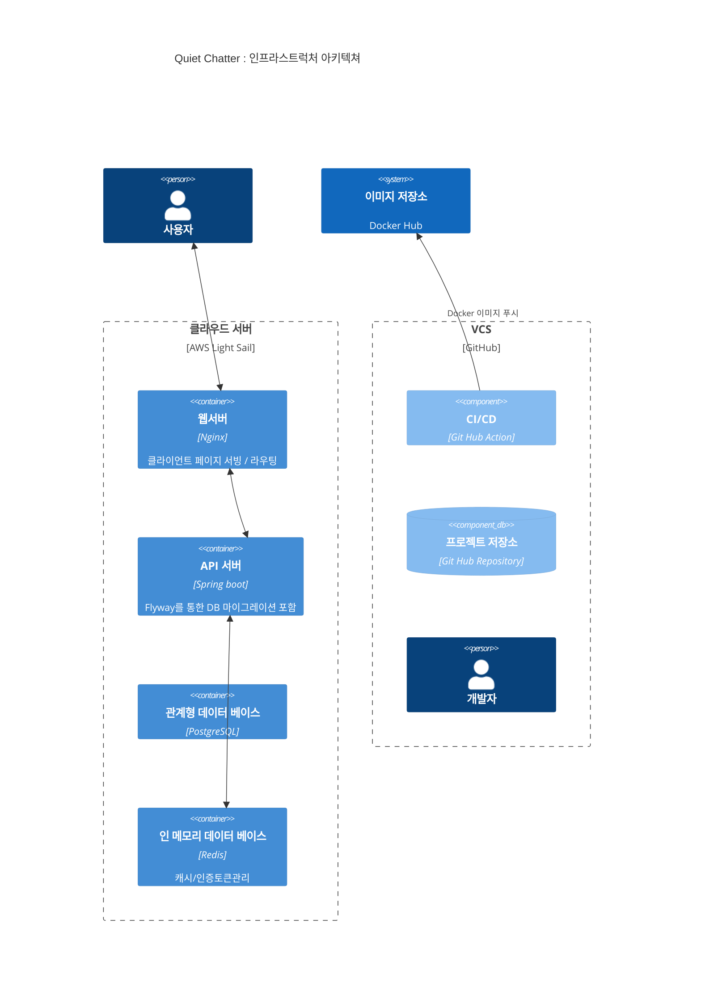
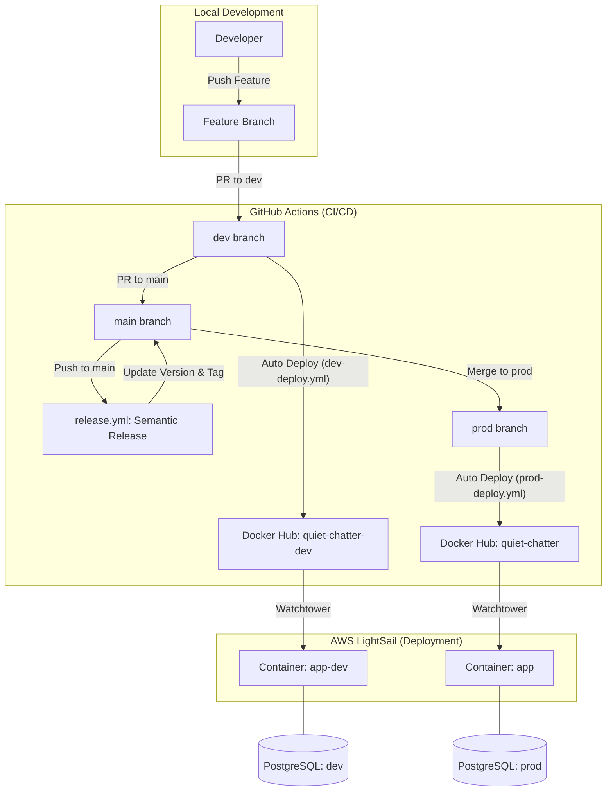

# 인프라스트럭처 아키텍쳐

## 스테이징 전략 (Staging Strategy)

### Production (운영)
- **도메인 (API)**: `api.quiet-chatter.com`
- **도메인 (Frontend)**: `quiet-chatter.com`
- **Docker 이미지**: `maskun2/quiet-chatter:latest`
- **데이터베이스**: PostgreSQL, Redis (DB 0)
- **릴리스 트리거**: `main` 브랜치 푸시(머지) 시 `Semantic Release` 작동 (버전 업데이트, 태그 생성, CHANGELOG 관리)
- **배포 트리거**: `prod` 브랜치 푸시(머지) 시 자동 배포 (Watchtower 감지)

### Development (개발)
- **도메인 (API)**: `dev-api.quiet-chatter.com`
- **도메인 (Frontend)**: `dev.quiet-chatter.com`
- **Docker 이미지**: `maskun2/quiet-chatter-dev:latest`
- **데이터베이스**: PostgreSQL, Redis (DB 1)
- **배포 트리거**: `dev` 브랜치 푸시 시 자동 배포 (Watchtower 감지)

## 배포 및 릴리스 파이프라인 (CI/CD)

### 1. Development (개발 서버)
1. `dev` 브랜치 푸시 감지
2. Gradle 빌드 및 테스트 수행 (`testDocs` 포함)
3. `quiet-chatter-dev` Docker 이미지 빌드 및 Docker Hub 푸시
4. **Watchtower**가 새 이미지를 감지하여 개발 서버 컨테이너 자동 재시작

### 2. Release & Production (운영 서버)
1. **릴리스 관리**: `main` 브랜치 머지 시 `release.yml` 실행
    - 커밋 메시지 분석 후 차기 버전 결정
    - `build.gradle` 버전 업데이트 및 `CHANGELOG.md` 생성
    - Git 태그 발행 및 GitHub Release 생성
2. **운영 배포**: `prod` 브랜치 푸시(머지) 시 `prod-deploy.yml` 실행
    - Gradle 빌드 (테스트 제외) 및 `openapi3.json` 자동 생성
    - `quiet-chatter` Docker 이미지 빌드 및 Docker Hub 푸시
3. 운영서버에서 **Watchtower**가 새 이미지를 감지하여 컨테이너 재시작

---

## 인프라 아키텍처 다이어그램 (Staging Flow)

