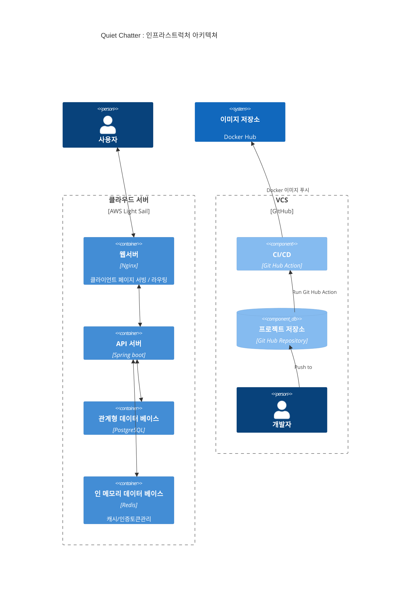

# 인프라스트럭처 아키텍쳐

```mermaid
    C4Context
    title Quiet Chatter : 인프라스트럭처 아키텍쳐
    Person(user, "사용자")

    Boundary(ststem, "클라우드 서버", "AWS Light Sail") {
        Container(ws, "웹서버", "Nginx", "클라이언트 페이지 서빙 / 라우팅")
        Container(api_server, "API 서버", "Spring boot")
        Container(db, "관계형 데이터 베이스", "PostgreSQL")
        Container(in_memory_db, "인 메모리 데이터 베이스", "Redis", "캐시/인증토큰관리")
    }

    Boundary(git, "VCS", "GitHub") {
        Component(gitAction, "CI/CD", "Git Hub Action")
        ComponentDb(repository, "프로젝트 저장소", "Git Hub Repository")
        Person(developer, "개발자")
    }
    System(dockerhub, "이미지 저장소", "Docker Hub")
    BiRel(user, ws, "")
    Rel(gitAction, dockerhub, "Docker 이미지 푸시")
    BiRel(ws, api_server, "")
    BiRel(in_memory_db, api_server, "")
    Rel(developer, repository, "Push to")
    Rel(repository, gitAction, "Run Git Hub Action")
    BiRel(api_server, db, "")

```
