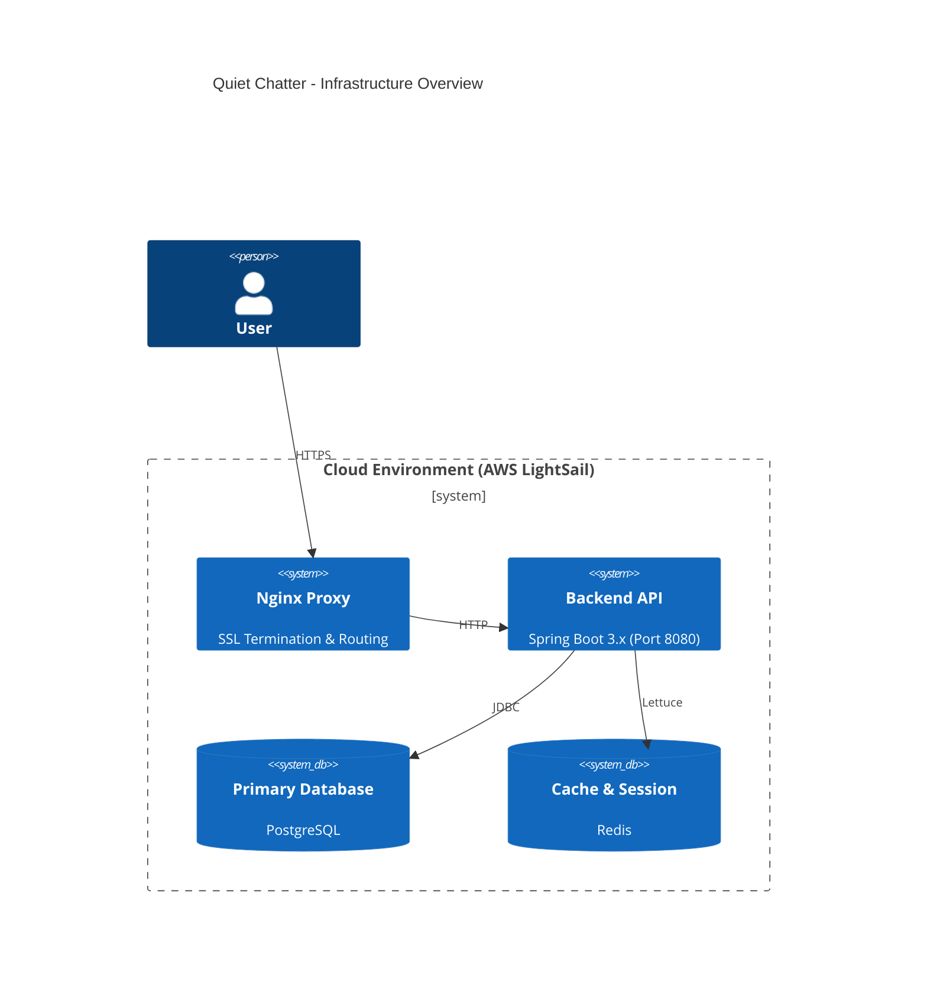
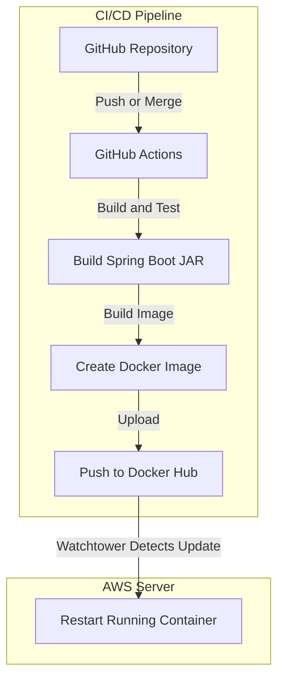

# Infrastructure and Deployment Guide

This guide explains the physical deployment pipeline, cloud environments, and CI/CD setup of our backend project. For logical code organization, see `architecture_guide.md`.

## 1. Physical Architecture

The application runs as a containerized Docker service on AWS LightSail. It connects to PostgreSQL for persistent data and Redis for caching.

### 1.1 Staging Environments

- **Environments**: We maintain two active environments: `dev` and `prod`.
- **Properties**: Managed by Spring Profiles (`application-dev.yml` and `application-prod.yml`).
- **Data Isolation**:
    - **Development (`dev`)**: Uses its own database schema and connects to Redis Database `1`.
    - **Production (`prod`)**: Uses the main schema and connects to Redis Database `0`.

> **Note**: For exact domain names and detailed server policies, see **[infrastructure_policy.md](https://github.com/maskun2/quiet-chatter-docs/blob/main/infrastructure_policy.md)** in the shared documentation repository.

---

## 2. CI/CD Pipeline

We use **GitHub Actions** for Continuous Integration (building and testing) and **Watchtower** for Continuous Deployment.

### 2.1 Build and Test (CI)

- **Triggers**: Automated workflows run when a Pull Request is opened against the `dev` or `main` branches.
- **Tests**: The pipeline runs `./gradlew test` to verify unit and integration tests.
- **Documentation**: It also automatically generates the OpenAPI documentation using RestDocs.

### 2.2 Deployment Flow (CD)

Our deployment follows these automated steps:

1. **Release Versioning**: Merging code into the `main` branch triggers `semantic-release`, which tags the new release version.
2. **Build Docker Image**: A GitHub Action builds an updated Docker image (`maskun2/quiet-chatter`) and pushes it to Docker Hub.
3. **Automatic Update**:
    - **Watchtower**, a tool running directly on the AWS server, monitors Docker Hub for updates.
    - When it detects the new image tag, it automatically downloads the image and restarts the Spring Boot container, ensuring very minimal or zero downtime.

