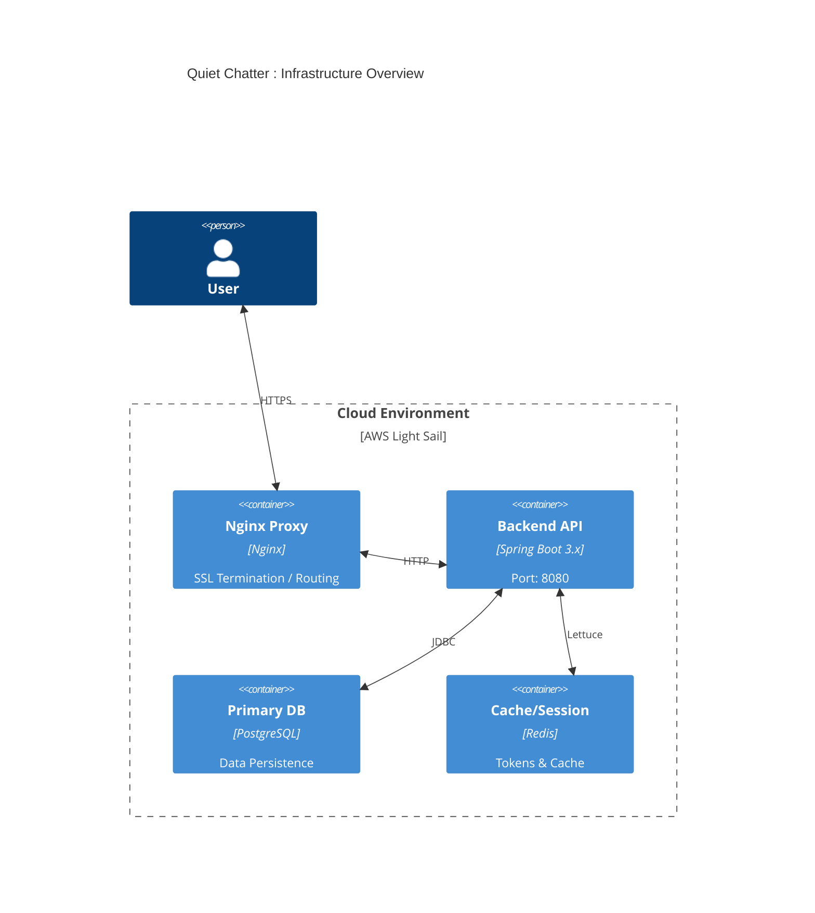
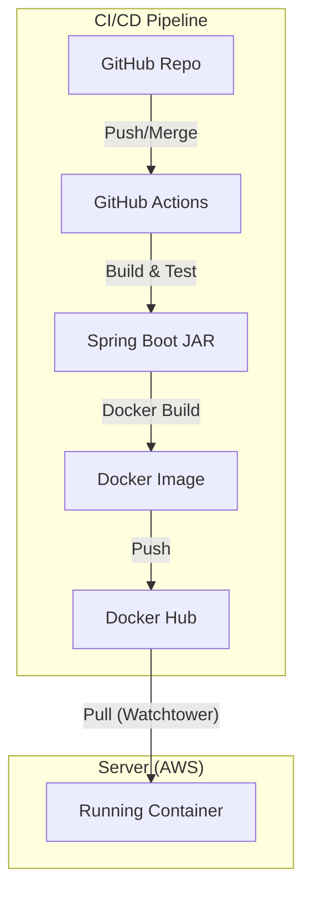

# Project Structure & Architecture Guide

This document explains both the logical code organization (**Hexagonal Architecture**) and the physical infrastructure (
**Deployment & Pipeline**) of the backend project.

## 1. Logical Architecture (Hexagonal)

We follow the **Ports and Adapters** pattern to isolate core business logic from external concerns (Web, DB, Messaging).

### 1.1 Core Principle: Dependency Rule

Dependencies must point **inward**: `Adapter -> Application -> Domain`.

- **Domain Layer**: Pure business logic. Entities and Value Objects (VO). No framework dependencies (except minimal JPA
  annotations for pragmatism).
- **Application Layer**: Use Cases (Services). Orchestrates domain objects and defines **Ports** (interfaces) for
  external communication.
- **Adapter Layer**: Implementation details.
    - **Inbound**: Web Controllers, Scheduled Tasks.
    - **Outbound**: JPA Repositories, Redis Clients, External APIs.

### 1.2 Package Structure

Each feature module (e.g., `member`, `book`, `talk`) is self-contained.

- Use `package-private` access modifiers by default to hide implementation details.
- Public classes should only be exposed via clear interfaces.

---

## 2. Physical Architecture (Infrastructure)

The application runs as a containerized service on AWS LightSail, supported by PostgreSQL and Redis.

### 2.1 Staging Strategy

- **Environments**: We maintain `dev` and `prod` environments.
- **Configuration**: Managed via Spring Profiles (`application-dev.yml`, `application-prod.yml`).
- **Data Isolation**:
    - **Dev**: Uses separate DB schema/instance and Redis DB 1.
    - **Prod**: Uses production DB schema and Redis DB 0.

*(For specific domain URLs and deployment policies, refer
to **[infrastructure_policy.md](https://github.com/maskun2/quiet-chatter-docs/blob/main/infrastructure_policy.md)** in
the shared documentation.)*

---

## 3. CI/CD Pipeline

We use **GitHub Actions** for automation and **Watchtower** for deployment.

### 3.1 Build & Test (CI)

- Triggered on PRs to `dev` or `main`.
- Runs `./gradlew test` (Unit/Integration tests).
- Generates API documentation via RestDocs.

### 3.2 Deployment Flow (CD)

1. **Release**: Merging to `main` triggers `semantic-release` to tag a new version.
2. **Build Image**: GitHub Actions builds the Docker image (`maskun2/quiet-chatter`) and pushes it to Docker Hub.
3. **Deploy**:
    - **Watchtower** (running on the server) detects the new image tag.
    - Automatically pulls the image and restarts the Spring Boot container with zero-downtime (rolling update if
      configured, or minimal downtime).

