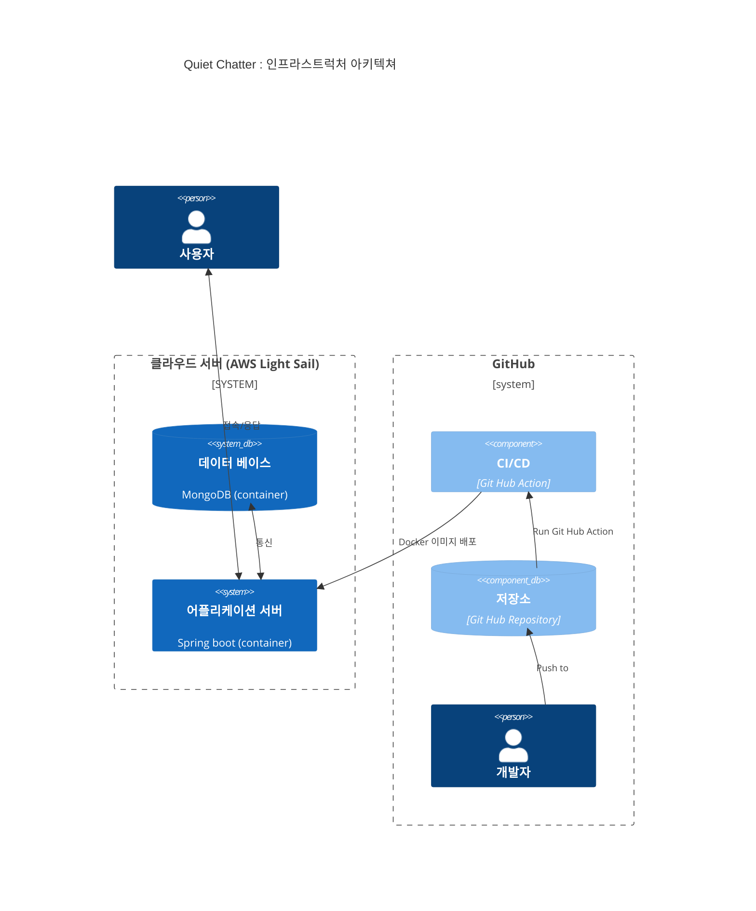
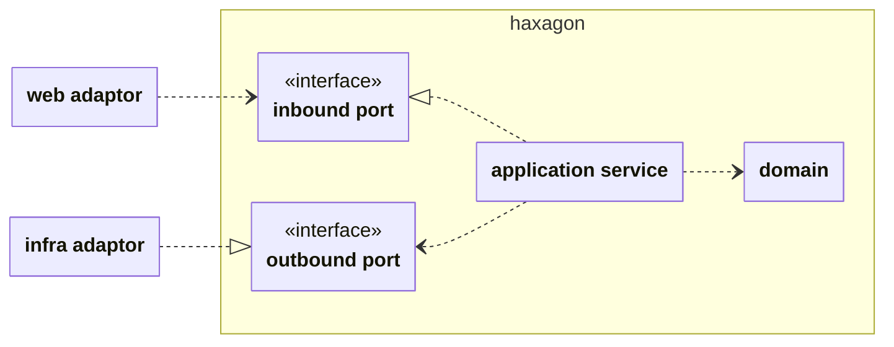

# 시스템 아키텍처

## 인프라스트럭처 아키텍쳐

```mermaid
    C4Context
    title Quiet Chatter : 인프라스트럭처 아키텍쳐

    Person(user, "사용자")


    System_Boundary(ststem,"클라우드 서버 (AWS Light Sail)") {
        SystemDb(db,"데이터 베이스","MongoDB (container)")
        System(app,"어플리케이션 서버", "Spring boot (container)")
    }

    Boundary(git, "GitHub"){

        Component(gitAction, "CI/CD","Git Hub Action")
        ComponentDb(repository, "저장소","Git Hub Repository")
        Person(developer, "개발자")
    }


    BiRel(user, app, "접속/응답")
    Rel(developer, repository, "Push to")
    Rel(gitAction, app, "Docker 이미지 배포")
    Rel(repository, gitAction, "Run Git Hub Action")
    BiRel(app, db, "통신")

```
## 애플리케이션 아키텍쳐 (Hexagonal Architecture)

```mermaid
---
config:
  class:
    hideEmptyMembersBox: true
---
classDiagram
    direction LR
    namespace haxagon {
        class domain {
        }
        class `application service`{
        }
        class `inbound port` {
            <<interface>>
        }
        class `outbound port` {
            <<interface>>
        }
    }
    class `web adaptor` {
    }
    class `infra adaptor` {
    }

    `web adaptor` ..> `inbound port`
    `inbound port` <|.. `application service`
    `application service` ..> domain
    `outbound port` <.. `application service`
    `infra adaptor` ..|> `outbound port`

```
