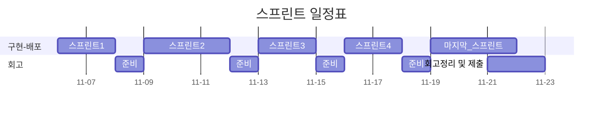

오픈미션 회고
---

- [막막한 감정의 너머](#막막한-감정의-너머)
- [프리코스와-오픈미션](#프리코스와-오픈미션)
- [1회차-스프린트-작업](#1회차-스프린트-작업)
    - [CI/CD-구축-작업](#11-cicd-구축-작업)
    - [엔티티-설계-테스트-기반구축](#12-엔티티-설계-테스트-기반구축)
    - [1회차-스프린트-회고](#1회차-스프린트-회고)
- [2회차-스프린트-작업](#2회차-스프린트-작업)
    - [외부-api를-테스트하기-네이버-검색](#21-외부-api를-테스트하기-네이버-검색)
    - [테스트-픽스쳐에-대한-고민과-적용](#22-테스트-픽스쳐에-대한-고민과-적용)
    - [ip-에서-domain으로-그리고-http-에서-https로](#23-ip-에서-domain으로-그리고-http-에서-https로)
    - [2회차-스프린트-회고](#2회차-스프린트-회고)
- [3회차-스프린트-작업](#3회차-스프린트-작업)
    - [비로그인-독후감-작성기능-익명인증-기능-추가하기](#31-비로그인-독후감-작성기능-익명인증-기능-추가하기)
    - [anonymous-를-guest로-승격하는-인증필터를-테스트하기](#32-anonymous-를-guest로-승격하는-인증필터를-테스트하기)
    - [jpa연관관계에-대한-고민-엔티티-or-id-참조](#33-jpa연관관계에-대한-고민-엔티티-or-id-참조)
    - [3회차-스프린트-회고](#3회차-스프린트-회고)
- [4회차-스프린트-작업](#4회차-스프린트-작업)
    - [효율적인-좋아요-기능을-고민하기](#41-효율적인-좋아요-기능을-고민하기)
    - [세션인증-하나의-사용자-하나의-북톡-하나의-좋아요](#411-세션인증-하나의-사용자-하나의-북톡-하나의-좋아요)
    - [좋아요의-응답성](#412-좋아요의-응답성)
    - [4회차-스프린트-회고-그리고-첫-론칭](#4회차-스프린트-회고-그리고-첫-론칭)
- [마지막-스프린트-작업](#마지막-스프린트-작업)
    - [마지막-스프린트를-준비하며](#50-마지막-스프린트를-준비하며)
- [최종-회고, 그리고](#최종-회고-그리고)

---

<br><br>

### 막막한 감정의 너머

이번 오픈미션에 대한 설명을 듣고나서 막막한 감정을 마주하고 말았다. 아마 지난 3주간 구체적인 문제와 제약조건이 있는 상황에 익숙해진 탓도 있으리라 생각했다.


얼마전 한강으로 산책을 나갔다가 눈앞의 탁 트인 풍경에 어지러움을 느꼈다. 지난 주차까지 밤낮으로 모니터만 보던 나의 눈이 손을 뻗으면 닿을 정도의 거리감 정도에만 익숙해서 적응을 하지 못한 까닭이었다. 나는 둔치에 잠시 앉아서 숨을 고르며 어지러움증이 잦아들 때까지 기다렸다. 시월의 한강은 구름 한점 없는 하늘 만큼이나 청명했고 한껏 빛을 머금은 윤슬은 무척 생기가 가득했다.

생각해보면 세상은 원래 광활한 편이었다. 문밖은 작은 새소리와 아이들의 웃음소리가 발 디딜 틈 없이 일렁대는 곳이었고, 지하철 역 앞 정류소는 헤아릴 없을 만큼 무수한 감정들이 눈빛 너머로 지나쳐가는 곳이었다. 내가 잠시 잊고 있던 것처럼, 내가 걸음을 멈춘다고해서 행인들은 걸음을 멈추지 않을 것이고 내가 설령 우아한 테크코스에 합격했다고 한들 수료 직후의 내게 한강의 풍경은 지금과 같을 것이라고 생각했다.

그래서 나는 마음을 달리 먹어야겠다고 생각했다. 손에 잡힐듯한 성취에 스스로의 눈을 멀게하고 싶지 않았다. 이번 오픈 미션이 마감을 끝으로 소모되는 단발의 총성이 아니라, 매일 울리는 풍경(風磬)이 되어 생애의 운율로 남았으면 했다. 그래서 지속 가능하고 자족 가능한 성장을 위해서 어떤 것에 마음을 쏟아야 할지를 고민했다. 이러한 생각은 꼬리에 꼬리를 물었고 결국 실제로는 중요하지 않았던 것들을 위시한다며 서랍안에 접어 두었던 생애의 의문을 돌이켜 보게끔 나의 마음을 움직였다.

나는 특정한 주제로 사람을 연결하는 일에 줄곧 흥미를 느껴왔다. 과거 2년간 진행해온 독서모임도 그런 차원에서의 시도였다. 모임을 운영하며 나름의 보람이 있었지만 많은 사람들이 스스로의 능력을 과소평가하고 본인을 드러내기 쑥스러워 하는 까닭에 모임의 문턱 앞에서 돌아갔던 기억들이 여전히 마음 한켠에 숙제처럼 남아있었다. 아마도 '나는 이곳에 어울리지 않아' 같은 내적인 속삭임으로 대변될 수 있을 그 마음들을 생각하면서, 이 문제를 해결하기 위한 시도으로써 이번 오픈 미션을 시작해보면 좋겠다고 생각했다. 그리고 그 미션의 결과물이 '너는 이곳에 어울려' 라는 메세지를 전달해줄 수 있길 원했다.

그래서 나는 수줍음이 많은 사람들을 위한 독서를 주제로한 소셜네트워크 애플리케이션을 만드는 것을 이번 오픈미션 과제로 정했다. 이름은 `Quiet Chatter: You Belong Here`로 정했다. 익명으로 자신을 드러내지 않고 책에 대한 감상을 나누고 좋아요과 공감한다는 반응을 나누게 하면 편안함 느낌을 주지 않을까 생각했다. 자신이 글이 영원히 인터넷에 박제될 수 있다는 두려움을 없애기 위해서 시간이 지나면 자동으로 비공개되는 짧은 호흡의 감상평이나 추천사를 나눌 수 있으면 좋겠다고 생각했다.

이러한 서비스는 얼마전에 봤던 유투브 영상([스마트폰 던지고 종이책 잡은 MZ들 | SBS](https://www.youtube.com/watch?v=nUuE-PIL2wM))에서 영감을 얻었다. 거의 사장되어가고 있던 독서 문화가 20대를 중심으로 다시 성장하고 있었고 그 중심에서 어느 한 독립서점의 이야기를 볼 수 있었다. 책을 좋아하는 단골 손님들이 처음 오는 손님들을 위해서 책 진열대 위로 각종 편지와 추천하는 내용의 메모를 붙여두기 시작했고 이는 점점 발전해서 그 서점은 동네 주민들이 서로의 감상을 교류하는 작은 생태계가 되어 있었다. 나또한 가끔 독립 서점을 들릴 때마다 누군가가 적어둔 추천사를 보며 알라딘이나 인터넷 서점과는 다른 현장감과 따뜻함을 느끼곤 했다. 나는 이러한 교류가 사람의 마음을 움직일 수 있겠다고 생각했다. 그래서 내 서비스에 그것을 적용하고 싶었다.


<br><br>

### 프리코스와 오픈미션

나는 본 프로젝트가 장차 틀을 깨고 달려나가더라도 지난 3주동안의 프리코스의 과정이 녹아 들어가기를 원했다. 다시말해 본 프로젝트에서 내가 배운 것들을 그대로 응용함으로써 그간의 배움의 과정이 확장되기를 원했다.

그래서 멋진 새 기술이나 언어를 사용해서 화려한 모습을 보이는 것보다 익숙한 기술을 사용하더라도 본 프로젝트를 설계하고 구현하는 디테일에 그간의 진정성을 담고 싶었다. 구체적으로는 나는 지난 3주간 집중했던 객체지향과 그 원칙(OOP & SOLID), 테스트 주도 개발(TDD), 클린코드(Clean Code), 확장가능한 설계 (DDD, 클린 아키텍쳐)를 그대로 녹여내고 싶었다.

하지만 이번 프로젝트를 도전하는데 있어서 새로운 기술의 도입은 필수불가결했다. 누구나 접속 가능한 애플리케이션을 만들기 위해서는 웹과 호스팅 기술이 필요했고 독후감을 남기고 저장하기 위해서는 UI와 데이터베이스 기술이 필요했다.

딜레마는 항상 있다. 그리고 한쪽을 선택하기 보다 중요한 것의 비중을 더 많이 가져가고 필요할 때마다 조정하는 것이 대게 좋은 결정이었던 것 같다. 그래서 새로운 기술의 도입은 최소화하기로 했다.

이러한 취지에 맞춰 언어는 프리코스에서 사용하던 그대로 Java 21을 사용하고 웹 애플리케이션 서버(WAS) 구동을 위해 대중적인 Spring Boot를 사용했다. 호스팅을 위해서 클라우드 서버로 AWS EC2 보다 단순한 LightSail을 사용했다. UI를 위해서 내게 어려운 React 대신 쉬운 ThymeLeaf로 대신하기로 했다. 데이터베이스는 다양한 데이터를 쉽게 담을 수 있는 PostgreSQL을 사용했고 접근기술로는 추상화가 잘된 Spring Data JPA를 도입했다. 추가적으로 통합과 배포(CI/CD)를 미리 설정해두고 신경쓰지 않기 위해서 GitAction과 Docker Compose 정도만 도입했다.

부대 기술을 정했으니 구체적으로 어떻게 이번 오픈미션에서 지난 프리코스에서 배운 것들을 적용할지 적어볼 필요가 있었다. 그래서 나는 다음과 같이 제한조건과 목표를 설정했다.  
[README.md#나의-오픈미션-목표](/README.md#나의-오픈미션-목표)

<br><br>

### 프로젝트 빌드와 첫 스프린트(2025-11-06 TH)

본 프로젝트를 실행하기에 앞서 나는 단순히 흐릿한 아이디어만 있었고 사전에 준비해온 것이 전혀 없었기 때문에 즉각적인 설계와 발맞춘 개발이 필요했다. 그래서 나는 점진적 개발 모델을 통해서 개발을 수행해야겠다고 생각했다. 처음부터 모든 것을 설계하지 않고 작은 배포 단위로 반복적으로 기획 - 설계 - 구현을 반복하고자 했다.

나는 6일 새벽에 프로젝트 초기 세팅과 아주 간단한 요구사항 작성을 끝내고 깃허브에 첫 푸쉬를 했다. 점진적인 개발을 위해서 일정 간격으로 스프린트를 진행할 예정이다. 오늘부터 작업을 시작해서 현재까지의 다음 배포를 7일에 수행하기로 했다.



<br><br>

### 1회차 스프린트 작업

#### 1.1 CI/CD 구축 작업

- 최소한의 CICD 구축
    -[x] 깃허브 저장소에 시크릿 등록
    - [x] AWS Light Sail 인스턴스 생성
    - [x] 프로젝트 Dokcerfile 작성
    - [x] 깃 액션 배포 스크립트 작성

나는 통합과 배포(CI/CD)를 미리 설정해두고 신경쓰지 않기 위해서 깃허브 액션을 도입하여 최소한의 CI/CD 워크플로우를 도입했다. 나는 스크립트 작성을 못하지만 이 부분은 LLM의 많은 도움을 받았다.

배포방법에 대한 고민도 했는데 jar로 배포하는 것보다 도커로 이미지 단위로 배포하는 것이 따로 서버에 JDK와 같은 필요한 의존성을 따로 관리할 필요가 없어 유리하다고 생각했다. 그래서 통합단계에서 도커이미지를 Push하고 인스턴스에서 직접 Pull해서 Docker Compose로 실행하는 방식을 택했다. 또한 컨테이너 가동에 필요한 환경변수는 서버쪽에서 가지고 있는게 좋겠다는 판단을 했다. docker-compose.yml에 서버와 db에 대한 정보를 작성하고 환경변수도 미리 작성하여 가동했다.

서버를 외부로 공개하기 위해서 클라우드 서비스로 AWS Light Sail을 서버 인스턴스로 적용했다. 이에 대한 별다른 지식이 없는터라 가장 저렴한 Light Sail의 인스턴스를 고르고 말았는데 여유 메모리가 너무 작아 DB를 이미지로 설치하다가 서버가 터지고 말았다. 나중에 사양이 낮아 가용 메모리가 부족했던 사실을 알고나서 더 높은 스펙의 인스턴스를 생성했다. 다음부터는 꼭 실행할 앱의 필요한 메모리를 사전에 계산해야겠다고 생각했다.


최소한의 인프라만 구축하려고 했는데 생각보다 부대 작업에 시간이 무척 많이 소요된 것 같다. 아무쪼록 열심히 씨름한 끝에 결국 첫 배포를 완료하였다 :)

<br><br>

#### 1.2 엔티티 설계/ 테스트 기반구축

- 도메인 표현 기술 설계
    - [x] 엔티티 기본 구조(아이디, 필드 타입) 설계
- 테스트 환경설정
    - [x] 테스트 컨테이너 설정

본격적으로 바로 도메인 모델 구축 작업을 하려고 시도했으나 막상 시작하려고하니 여러 설계적인 고민 때문에 바로 작업에 들어가지 못하고 깊은 공부가 필요했다.

처음 고민했던 부분은 엔티티의 ID 필드를 어떻게 정의할 것인지였다. 보통 많이 사용하는 Long 타입은 엔티티의 ID를 담는 타입으로 쓰기엔 도메인 표현력이 부족했다. 그래서 UUID를 공통 Id 타입으로 두는 것과 직접 엔티티마다의 Id 클래스를 두는 것 사이에서 고민해야했다. UUID의 통용성과 편의성을 선택할지, 각 클래스마다 컨버터 구현이 필요하더라도 도메인 표현성을 높기 위해 Id 클래스를 도입할지에 대한 고민을 하면서 결국 UUID 클래스를 도입하기로 마음 먹었다. UUID는 자바 표준이고 Long 타입보다 표현력이 좋으면서 또한 여러 다른 DB를 사용하더라도 별다른 변경없이 사용이 가능해서 차용했다. 도메인 계층은 확실히 Id라는 모델에 대한 표현력이 좋아지기를 기대했다.

나는 PostgreSQL를 사용했고 로컬 테스트에서도 데이터베이스와 통합된 테스트를 하고 싶었다. 그래서 추가적으로 [학습](https://java.testcontainers.org/modules/databases/jdbc/)을 통해 테스트 컨테이너를 도입하게 되었다. 그리고 제대로된 쿼리가 나갔는지 확인하기 위한 로깅레벨 설정과 테스트 프로파일 설정도 함께 익히게 되었다.

<br><br>

#### 1회차 스프린트 회고

1회차에서는 본격적으로 프로젝트를 수행하기 위한 빌드, 배포, 테스트 준비 작업이 주를 이루었다. 스프린트를 시작하기에 앞서 최소한의 인프라만 기술과 구축하려고 했는데 생각보다 고려해야할 것도 많고 시행착오도 많았다. 막상 속도를 위해서 최소한의 기술을 도입하려고 했지만 공부를 하다보니 관련 기술이나 좀더 깊게 기술을 다루는 것에 흥미가 생겨서 종종 검색의 삼천포에 빠지기도 했다.

예를 들어 보안을 위해 프라이빗 서브넷을 깔고 프라이빗 서버로 이중화하기, 향후 요청을 캐싱하기 위해 Redis 도입할지, 지금처럼 ThymeLeaf로 서버사이드 렌더링이 아니라 따로 웹서버를 둘지, 보안을 위해서 JWT 방식을 도입할지 같은 것들이다. 1회차 내내 이런 유혹에 시달렸지만 결국 떨처낼 수 있었다.

언급한 기술들은 필요할 것들이고 좋은 기술들이지만 건축으로 따지자면 난방시스템, 보안시스템, 조명시스템 같은 것이라고 생각한다. 아직 집이 지어지지도 않고 사람이 들어와 살지 않는데 이런 것들을 일찍 생각하다보면 사공많은 배가 산으로 가는 것처럼 프로젝트가 진척되지 않을 것이라고 생각했다. 신경이 쓰이는 것은 사실이지만 의도적으로 넘어가는 연습이 필요한 것 같다는 생각이 든다. 서비스를 만드는데 있어서 정말 중요한 것은 사용할 수 있는 서비스를 만드는 일이다.

우아한 테크코스 프리코스 마지막에 있는 최종 코딩 테스트에 대한 얘기들이 생각이 났다. '안돌아가는 프로그램보다 돌아가는 쓰레기를 만들라'는 말처럼 우리가 아는 것을 모두 고려하는 것이 현실적으로 불가능할 때가 많고 중요한 것을 먼저 생각하고 합리적으로 선택해야겠다고 생각하게 되었다.

비단 개발에서만이 아니라 실생활에서도 적용이 되는 말이기도 하다. 나는 지금 필요하지 않은 것들을 생각하고 걱정하느라 지금 해야할 것들을 놓치고 있지는 않을까 반성하게 되었다. 인생에 있어서 우선순위는 거듭해서 스스로 상기하지 않으면 쉽게 질서를 잃어버린다. 내가 그간 신경쓰지 못한 게 무엇일까 생각하다가 이참에 부모님에게 안부전화를 드렸다. 전화기 너머로 현재 우테코 지원에 집중하느라 무직인 내 상황에 대해 걱정과 애정이 섞인 잔소리를 들었지만 기분은 좋았다.

어느덧 시간이 흘러 단풍이 예쁘게 물들고 있었다. 돌이켜본다면 어떤 일을 붙잡고 있느라 계절의 변화를 느껴보지 못했던 적이 종종 있었던 것 같다. 중요한 일이었을 수도 있고 그 때 열심히 하지 않았더라면 지금의 나는 없을 수도 있다. 그래도 확실한 사실은 그 시절의 벚꽃을 볼 정도의 물리적인 여유는 충분했다는 것이다. 다만 이완없는 긴장으로 인해 그럴 생각을 못했던 것 같다. 좋은 풍경은 휴식을 주지만 의도적으로 그런 환경에 머물지 않는다면 휴식을 찾기 어렵겠구나 생각했다.


환경은 그곳에 머무는 사람에게 영향을 준다. 만약 우테코에 합격한다면 우테코라는 환경은 내게 어떤 영향을 줄까? 가능성은 뒤로한채 잠깐 상상해보기도 했다.


---

<br><br>

### 2회차 스프린트 작업

#### 2.1 외부 API를 테스트하기: 네이버 검색

학습을 통해서 [네이버 개발자 센터에서 책은 검색할 수 있는 API](https://developers.naver.com/docs/serviceapi/search/book/book.md#%EC%B1%85)를 발견하고 사용등록을 했다. API를 사용하는 것은 어렵지 않았다. 다만 외부 API를 테스트 코드에 적용해본 적이 없어서 많은 시행착오를 겪었다.

우선 외부 API는 시간과 비용이 많이 들기 때문에 이를 테스트 하는 것은 기존 단위테스트와는 분리해야했다. 그래서 [org.junit.jupiter.api.Tag를 사용하여 gradle 테스트 테스크에서 제외하는 방법](https://random-topic.tistory.com/190)을 공부하게 되었고 이를 빌드 스크립트에 분리시켰다. 테스트 코드에서는 외부 API 테스트가 필요한 경우에만 `@Tag("external-api")`만 붙였다.

추가로 외부 API 테스트에 필요한 API 키는 보안을 위해서 프로퍼티로 로컬 테스트에서 주입시키는 방법을 알게되었다. `gradle.properties`에서 해당 프로퍼티가 정의되어 있지 않으면 예외를 던지므로 편하게 테스트가 가능했다. Gradle 빌드 스크립트는 내게 익숙치 않았는데 이참에 조금 공부할 수 있어서 좋았다.

```groovy
//build.gradle
tasks.named('test', Test) {
    useJUnitPlatform()
    useJUnitPlatform {
        excludeTags("external-api")
    }
}

tasks.register("testExternalApi", Test) {
    group = "verification"
    description = "외부 API 테스트"

    useJUnitPlatform {
        includeTags("external-api")
    }

    def naverApiClientIdName = 'naver.api.client-id'
    def naverApiClientSecretName = 'naver.api.client-secret'

    systemProperty naverApiClientIdName, project.property(naverApiClientIdName)
    systemProperty naverApiClientSecretName, project.property(naverApiClientSecretName)
}
```

그다음 집중한 것은 외부 API를 모킹하는 테스트이다. 이부분도 경험이 없어서 [검색](https://www.baeldung.com/restclienttest-in-spring-boot)을 통해서 `@RestClientTest`를 사용하면 테스트 클래스에서 간편히 Mock서버를 빈으로 등록할 수 있고 이를 가져와 테스트 할 수 있다는 사실을 알았다.

그래서 나는 네이버 검색 API를 사용하는 빈(NaverBookSearcher.class)가 생성자에서 `RestClient`가 아니라 `RestClient.Builder`를 의존하여 주입받도록 변경했다. 네이버 검색 API를 사용하는 빈(NaverBookSearcher.class)은 해당 빌더를 받아서 필요한 디폴트 URL과 해더를 설정하여 `build()`를 호출하여 직접 `RestClient`를 만들도록 했다.

`@RestClientTest`을 사용하여 테스트에서 전달받는 `RestClient.Builder`을 목서버로 모킹하도록 설정했다. 목서버에 바인딩된 `RestClient.Builder`를 통해 생성된  `RestClient`는 자동으로 목서버와 통신하도록 작동하는 것을 배웠다. 작성된 코드의 예시는 아래와 같다.

```java

@RestClientTest(NaverBookSearcher.class)
class NaverBookSearcherTest {
    @Autowired
    private NaverBookSearcher naverBookSearcher;

    @Autowired
    MockRestServiceServer mockServer;

    @MockitoBean
    private NaverApiEnvironment naverApiEnvironment;

    @Test
    @DisplayName("API 모킹 단위 테스트")
    void findByKeywordMockedApi() {
        mockServer.expect(ExpectedCount.once(), MockRestRequestMatchers.anything())
                .andRespond(withSuccess(
                        """
                                {
                                    "total": 1,
                                    "start": 1,
                                    "display": 1,
                                    "items": [
                                        {
                                            "title": "수레바퀴 아래서",
                                            "isbn": "9788937460500"
                                        }
                                    ]
                                }""",
                        MediaType.APPLICATION_JSON
                ));

        Keyword keyword = new Keyword("수레바퀴 아래서");
        PageRequest pageRequest = PageRequest.of(0, 10);

        Page<Book> books = naverBookSearcher.findByKeyword(keyword, pageRequest);

        assertThat(books.getTotalElements()).isEqualTo(1);
        assertThat(books.getContent()).isNotEmpty();

        assertThat(books.getContent()).allSatisfy(book -> assertThat(book.getIsbn()).isNotNull());
    }
}
```

이번 공부를 통해서 다음부터 외부 API를 모킹하는 테스트를 더욱 자신감 있게 작성할 것 같다는 예감이 든다.

<br><br>

#### 2.2 테스트 픽스쳐에 대한 고민과 적용

[테스트는 어떻게 좋은 코드를 만드는가(feat. 험블 객체 패턴)](https://d2.naver.com/helloworld/9921217)

Quiet-Chatter의 `도서검색기능`은 외부API를 통해서 도서를 조회한 후 서버DB의 책을 `ISBN`으로 조회하여 있는 경우 `책` 정보를 업데이트하고 없으면 검색된 정보로 새로 저장한다.

이 기능을 만들기 위해서는 요청을 받는 컨트롤러와 서비스 그리고 리파지토리 빈들이 각자의 역할을 수행하고 협력하게 된다. 이 빈들은 책 엔티티를 다루는데 이를 단위 테스트하기 위해서는 테스트용 엔티티(Fixture) 객체가 필요하게 된다.

문제는 각 엔티티의 생성자나 수정 메서드는 그 자체로 비지니스 로직을 가지고 있기 때문에 이를 테스트하지 않을 때는 도메인 메서드의 변경이 테스트에 영향을 주지 않아야 한다는 점이다. 따라서 엔티티의 도메인 메서드와 독립적인 테스트 엔티티(Fixture)의 생성이 필요한데 이 작업이 무척 번거로왔다.

이를 수월하게 해줄 유명한 라이브러리가 두개 있었다.나는 네이버의 [FixtureMonkey](https://naver.github.io/fixture-monkey/v1-1-0/), Instancio의 [Instancio](https://www.instancio.org/user-guide) 를 차례로 적용해보았는데 결국 Instancio를 선정했다. 해외에서도 좀더 많이 사용되는 것 같고 별다른 객체 생성이나 옵션 설정 없이 정적 메서드로 바로 Fixture 생성이 가능했기 때문이다.

그리고 [DataFaker](https://www.datafaker.net)를 사용하여 좀더 책의 일렬번호(ISBN)과 같은 도메인적인 가짜 데이터를 테스트에 활용하기로 했다. 아래는 그 사례이다.

```java
public class BookFixture {

    public InstancioApi<Book> asNew() {
        return initBook().ignore(fields().declaredIn(BaseEntity.class));
    }

    private static InstancioApi<Book> initBook() {
        final Faker faker = new Faker(Locale.KOREA);

        return of(Book.class)
                .set(field(Book::getTitle), new Title(faker.book().title()))
                .set(field(Book::getIsbn), new Isbn(faker.code().isbn13()));
    }

    public InstancioApi<Book> asPersisted() {
        return initBook();
    }
}

```

처음에는 Fixture 라이브러리를 도입하는 것이 오버하는 것이 아닌가 회의감이 들었지만 이정도 수준의 새로운 기술 도입은 이유가 명확해서 괜찮았던 것 같다. 앞서 설명한대로 엔티티의 도메인 메서드와 독립적인 테스트 엔티티(Fixture)의 생성이 필요한 경우가 꼭 필요하기 때문이기도 하고 단순히 유틸 라이브러리이기 때문에 적용에 있어서 변경할 것이 없었던 것도 한 몫을 하였다.

이런 것을 공부하면 할 수록 표준화된 라이브러리로 빌드하는 것이 무척 중요하다고 느끼고 있다. 다양한 라이브러리 보다 신뢰할 수 있는 라이브러리와 그 API를 활용하면 좀더 핵심 도메인에 더 집중할 수 있다고 느끼고 있다.

<br><br>

#### 2.3 IP 에서 Domain으로 그리고 HTTP 에서 HTTPS로

아마존의 라이트세일 인스턴스는 정적 IP 매칭을 지원해준다. AWS에서 사용가능한 IP를 매칭하여 같은 경로로 접속할 수 있도록 변경해두었지만 곧 데모를 론칭하여 사용자의 피드백을 받으려면 좀 더 신뢰성있는 도메인을 두는 것이 좋겠다고 판단했다.

그래서 가비아에 접속하여 도메인을 구입하고 이를 라이트세일에 매칭하였다. AWS 콘솔이 상당히 추상화가 잘되어있어 별다른 서버 설정 없이 바로 적용이 가능해서 좋았지만 여전히 포트는 스프링부트의 8080 기본 포트를 적용하고 있었기에 웹브라우저의 주소 입력창에 포트를 적어야만 접속이 가능한 불편함이 있었다.

처음에는 스프링부트의 포트를 80 포트로 변경하여 HTTP 기본포트를 사용하게끔 하려고 했으나 직접 이 포트와 연결하는 방식은 보안상 권장되지 않는다는 사실을 알게되었다. 그래서 서버에 Nginx 웹서버로 리버스 프록시를 설정해두기로 했다. 웹서버로 80 포트 요청을 받아서 서버의 localhost:8080으로 전달하게 바꾸었다. 설정은 어렵지 않았다. 앞서 Docker compose를 적용해 두었기 때문에 간단한 yml 수정과 설정파일 추가로 이것이 가능했다.

추가적으로 보안접속을 위해서 `Certbot`을 사용하여 `Let's Encrypt`으로부터 SSL 인증서을 발급하고 NginX에 등록하여 최종적으로 보안접속이 가능하도록 수정했다.

이 모든 작업은 내가 머리로는 개념적으로 알고는 있었지만 해본적은 없던 것이었다. 때문에 많은 시행착오를 겪어야만 했다. 각종 라이브러리들은 내가 처음 써보는 것들이라서 헤매기도 했다. 아직까지도 반정도도 이해하지 못했지만 검색과 LLM을 통해서 구축은 가능했다. 일년 사이에 정보의 접근성이 좋아져서 이렇게 많은 작업을 할 수 있어서 정성스럽게 구축방법을 정리해둔 여러 개발 블로그에 무척 감사했다. 이 정보글 덕분에 결국 나의 홈페이지도 HTTPS를 사용해 https://quiet-chatter.com 으로 접속이 가능해졌다!


<br><br>

#### 2회차 스프린트 회고

이틀간의 작업에서는 보다 도메인 로직에 집중하려고 했으나 생각보다 도메인 구축, HTTPS, 보안 관련 작업이 절반이상을 차지할 정도로 오래 걸렸다. 사실 도메인로직에 집중해서 다른 제반 기술을 건드리지 않고자바만 개발하는 것은 개발자의 이상일지도 모르겠다는 생각을 한다. 어쩌면 이렇게 얕고 넓게 알아서 전체 시스템을 구축해나가는 경험이 결국 어떻게든 도움이 될 것이라는 생각을 한다.

정말 멋있는 자바 로직 코드를 작성하고 싶은 욕심도 있다. StreamAPI를 사용하여 3개의 메소드가 할 일을 하나로 단 몇줄만에 만든다거나 하는일, EventPublisher등을 이용해서 구조적으로 결합이 낮으면서도 효율적인 프로세스를 만드는일, 스레드와 동시성을 공부해서 이를 효율적으로 구현하여 대량의 트래픽을 견뎌낼 수 있는 코드를 만들어보는 것. 이것들은 모두 이상적으로 내가 바라는 것들이다.

다만 처음 접속할 사람들이 신뢰할 수 있는 도메인이름과 HTTPS를 지원하는 것을 우선한 것은 꼭 필요한 일인 것 같다. 서비스의 본질은 사용자이니 사용자 중심의 서비스를 만들어 나가야겠다는 생각은 든다. 그렇다고 제반기술에 너무 푹빠지지도 않고 필요한건만 선택적으로 추려서 적용하는 일이 중요하다는 생각이 이번 2회차 스프린트에서 들었다.

이번 2회차에서는 정말 구축해야할 것을 모두 해놓은 것 같다. 테스트 기반도 잘 잡혀있고 인프라도 이정도면 무척 안정적이다. 지금까지 힘을 모았으니 앞으로는 쭉쭉 죽순처럼 자랄 수 있겠다는 생각이 든다.

다음 3회차 스프린트에서는 유저 API와 북톡 API를 최소 수준으로 완성하고 공식 홍보에 나갈 목표를 세웠다. 실제 유저들의 트래픽과 피드백을 받아서 개선을 해나가는 것이 목표다.


---

<br><br>

### 3회차 스프린트 작업

#### 3.1 비로그인 독후감 작성기능: 익명인증 기능 추가하기

Quiet Chatter는 익명성을 중요한 가치로 두고 있다. 나는 사용자가 로그인을 하지않고 북톡(독후감)을 작성하도록 허용하고 싶었다.

그러나 애플리케이션 입장에서는 상황이 달랐다. 사용자가 로그인 폼에서 로그인을 하는 것과 별개로 서버에서는 접속한 사용자를 인식하고 식별할 필요가 있었다.

나는 앞서 TymeLeaf를 통해 클라이언트 페이지를 서버사이드에서 렌더링하고 있었으므로 Session 기반의 Stateful한 인증을 하는 편이 좋겠다고 생각했다. 따라서 접속한 사용자를 식별하기 위해서는 접속한 세션을 인증하는 과정이 필요했다. 이는 곧 서버 입장에서의 로그인과 같았다.

그래서 나는 Spring Security를 우선 의존성에 추가했다. 그리고 따로 지정하지 않은 경로는 Anonymous가 접근할 수 있도록 설정을 추가했다. 이를 바탕 설정으로 사용하되 필요할때에만 인증객체를 생성하도록 "ROLE_GUEST" 권한을 가지는 Guest 인증객체를 따로 구성할 필요가 있었다. 그래서 커스텀 인증 필터를 추가하여 특정 url로 접속했을 때 인증 상태가 Anonymous 인경우 "ROLE_GUEST"를 인증을 Spring Security Context에 업데이트 할 수 있는 기능을 추가하였다. 이 과정에서 Anonymous는 세션 자원을 절약하기 위해서 기본값으로 Spring Security에서 따로 세션을 만들지 않는다는 사실을 학습을 통해서 알게 되었다.

작성하고보니 간단한 작업이었는데 막상 Spring Security를 잘 모르다보니 시행착오가 많았다. CSRF설정과 Spring Security 인증절차에 대한 여전히 헷갈리는 부분들이 많은데 이 부분은 실제로 론칭을 하면서 수정해야할 것 같다는 생각이 들었다.

<br><br>

#### 3.2 Anonymous 를 Guest로 승격하는 인증필터를 테스트하기

사실 시큐리티를 구성하는 자체는 검색을 통해서 구축할 수 있어도 이것이 정말 잘 작동하는지 테스트하는 것은 내가 이 프로젝트를 계획하면서 세운 목표(테스트 없는 프로덕트 코드를 만들지 않는다)의 목표를 달성하기 위해서는 꼭 필요했다.

하지만 그 테스트를 작성하는 과정은 무척 어려웠다. 우선 스프링 시큐리티는 일반적으로 자동구성이 되고 내가 보통 작성하는 Controller 후단이 아니라 전단의 SecurityFilterChain에서 작동하기 때문에 이를 일반적인 MVC 테스트로 하는 것은 불가능 했다. 세션을 관리하는 것도 스프링 시큐리티에서 위임하기 때문이다.

따라서 테스트에서는 프로덕트 코드에서 작성한 필터를 그대로 사용하되 그 필터에서 의존하는 기능을 적절히 모킹할 필요가 있었다.

우선 모킹해야할 것은 Anonymous 를 Guest로 승격하는 인증필터, 즉 커스텀 필터가 인자로 전달받은 HttpServletRequest가 해당 필터가 직접 관여할 대상인지를 확인하는 RequestMatcher를 제공받게 하는 인터페이스였다. 나는 이를 다른 인터페이스로 분리하여 빈으로 등록하게 해두었고 테스트안에서는 @TestConfiguration을 통해서 프로덕트의 빈이 아니라 따로 모킹하여 테스트용 RequestMatcher를 제공하는 빈을 @Primary 애노테이션을 통해서 프로덕트의 SecurityConfiguration에서 이 모킹된 빈을 사용토록했다. 또한 RequestMatcher는 실제 컨트롤러와 매핑되어야하므로 200응답만을 하는 가상의 컨트롤러와 이 경로를 매핑하였다.

다음으로 모킹할 것은 Authentication을 제공하는 AuthenticationProvider였다. 커스텀 필터는 요청이 RequestMatcher에 적합하고 현재 인증상태가 Anonymous에 해당할 경우 AuthenticationProvider를 통해 어플리케이션에게 게스트 멤버 생성 요청을 해서 멤버를 생성하고 이를 바탕으로 AuthenticationToken을 발행받아 이를 Spring Security Context에 등록해야했다. 따라서 AuthenticationProvider를 인터페이스로 선언하고 이를 모킹하여 따로 데이터베이스 호출 없이 임의의 AuthenticationToken을 리턴하도록 했다.

마지막으로 이를 테스트할 테스트 클래스에서는 SecurityConfiguration을 Import하고 MockMvc를 사용하여 SecurityMockMvcResultMatchers를 통해서 실제로 Session에 등록된 Authentication의 authorities를 검증하도록 했다.

아래는 작성한 코드이다.

```java
package maskun.quietchatter.shared.security;

@WebMvcTest(GuestPromotionTest.FakeController.class)
@Import({SecurityConfig.class,
        WebConfig.class,
        AuthTokenProvider.class,
        GuestPromotionTest.FakeController.class})
class GuestPromotionTest {
    static final String PROMOTION_PATH = "/api/promotion";
    static final String ANONYMOUS_PATH = "/api/anonymous";

    @MockitoBean
    private AuthTokenProvider authTokenProvider;

    @Autowired
    private MockMvc mockMvc;

    @BeforeEach
    void setUp() {
        when(authTokenProvider.getGuest()).thenReturn(getGuestAuthToken());
    }

    private static @NotNull UsernamePasswordAuthenticationToken getGuestAuthToken() {
        return new UsernamePasswordAuthenticationToken(UUID.randomUUID(), null,
                List.of(new SimpleGrantedAuthority("ROLE_GUEST")));
    }

    @Test
    @DisplayName("필요한 경우 자동 승급")
    void promotion() throws Exception {
        mockMvc.perform(get(PROMOTION_PATH).with(csrf()))
                .andExpect(status().isOk())
                .andExpect(SecurityMockMvcResultMatchers.authenticated().withRoles("GUEST"));
    }

    @Test
    @DisplayName("승급이 필요하지 않은 경우 session을 만들지 않으므로 Authentication이 null임")
    void anonymous() throws Exception {
        mockMvc.perform(get(ANONYMOUS_PATH))
                .andExpect(status().isOk())
                .andExpect(SecurityMockMvcResultMatchers.unauthenticated());
    }

    @TestConfiguration
    public static class SecurityTestConfig {

        @Primary
        @Bean
        public GuestPromotion guestPromotion() {
            return () -> {
                Builder builder = PathPatternRequestMatcher.withDefaults();
                return List.of(
                        builder.matcher(HttpMethod.GET, PROMOTION_PATH)
                );
            };
        }
    }

    @RestController
    public static class FakeController {

        @GetMapping(PROMOTION_PATH)
        public ResponseEntity<?> getPromotions() {
            return ResponseEntity.ok().build();
        }

        @GetMapping(ANONYMOUS_PATH)
        public ResponseEntity<?> handleAnonymousRequest() {
            return ResponseEntity.ok().build();
        }
    }
}

```

나에게 있어서 인증 필터의 동작을 테스트해본 것은 처음이기도 하고 많이 헤맨것도 사실이다. 하지만 이번 기회를 통해서 Spring Security Chain 동작을 좀 더 잘이해하게 되었고 테스트에서 어떤 모킹을 해야하고 어떤 설정을 가져와서 적용해야하는지 포괄적인 이해가 생긴 것 같아서 좋았다.

만약 운영환경에서 시큐리티 체인에 문제가 있어 이를 디버깅으로 확인하려면 어떻게 해야할지 여전히 고민이지만 테스트라도 작성하게 되어서 적어도 원하는 동작대로 작동할거라는 기대감을 가질 수 있었다.

<br><br>

#### 3.3 JPA연관관계에 대한 고민: 엔티티 or ID 참조

JPA를 영속기술로 사용하면서 엔티티끼리의 연관관계를 필드 참조 방식(@ManyToOne과 같은 관계지정 방식)이 익숙했어서 그렇게 해왔는데 막상 그렇게 하니 여러 문제가 있었다.

우선 Spring Data JPA가 제공하는 리파지토리 인터페이스의 쿼리메소드방식을 사용하여 추상메서드인 FindByMemberId(UUID memberId)를 선언하게되면 말그대로 멤버의 아이디를 where절에 넣은 SQL이 나가는 것이 아니라 멤버 테이블과 찾고자하는 엔티티의 테이블에 대한 조인이 발생하게 되었다. 따라서 불필요한 조인이 발생해서 연관 ID을 활용한 조회 SQL에 효율적이지 않았다. 이는 Spring Data JPA의 쿼리메서드가 구문을 해석하는 방법에 따른 것이라서 따로 JPQL쿼리를 작성하거나 인자에 Member를 직접 넣는 방식의 쿼리메서드를 작성하지 않으면 안되었다.

또한 테스트시에도 어려운 점이 있었다. Talk은 Member와 연관관계를 가지는데 JPA를 다뤄서 데이터베이스를 직접 테스트할 때에 영속단계가 아닌 Member를 연관관계로 참조하고 있는 Talk을 Persist 시켜서 DB에 쓰는 것은 불가능했다. 이것이 가능하려면 Member가 이미 DB에 저장되어 영속상태여야하는데 Talk을 테스트하기 위해서 Member 를 영속상태로 일일이 저장하는 것은 무척 번거로웠으며 불필요한 결합이라고 생각하게 되었다.

JPA에서 연관 엔티티를 필드로 참조하는 것은 분명한 장점이 있었다. 영속성 컨택스트 안에서 필드접근을 통해서 그래프 탐색이 가능하고 필요시 추가적인 데이터를 로딩하여 활용이 가능하다. 나도 JPA는 자바 영속성에 있어서 표준 기술인데 그중 가장 중요한 연관관계 매핑을 사용하지 않는다는 것에 주저함을 느꼈다.

좀더 확실한 판단을 위해서 검색과 여러 사례를 학습하게 되었고 많은 사례에서 JPA의 필드 참조 연관관계 매핑의 장점을 인정하면서도 실무적인 차원에서 이를 지양한다는 것이 좀더 다수의 의견인 것을 알게되었다. 또한 좋아하는 최범균 님의 저서 [도메인 주도 개발 시작하기](https://www.aladin.co.kr/shop/wproduct.aspx?ItemId=291420687)을 다시 읽게 되었는데 애그리거트 간의 불필요한 참조 결합을 끊기 위해서 각각 ID를 가지는 것을 권장하는 내용을 바탕으로 최종적으로 각 엔티티에서 다른 엔티티에 대한 참조를 ID만 가지고 있게 하도록 엔티티 설계 방향을 변경했다.

하지만 JPA의 엔티티 필드 참조 방식은 여전히 사용할 여지는 두었다. 만약 어느 애그리거트루트의 하위 애그리거트 컬렉션을 직접 참조하고 다뤄야할 경우 하위 애그리거트를 ID로 참조하는 방식은 불편하다. 하위 애그리거트는 상위 애그리거트루트의 라이프 사이클의 종속적이므로 이런 경우는 ID 참조가 아니라 엔티티 필드 참조 방식이 더 적절할 것으로 생각되었다. 그래서 앞으로 이러한 구조가 나온다면 ID를 참조할지, 아니면 연관관계 필드로 참조할지는 취사 선택해야겠다는 생각이 들었다.

<br><br>

#### 3회차 스프린트 회고

이번 3회차는 어떻게 지나갔는지 모를 정도로 정말 빠르게 지나갔다. 본의 아니게 Spring Security의 늪에서 많은 시간을 허우적대고 말았다. 힘들긴 했지만 좋은 경험이었다. 이번에 내가 잘 알지 못하는 영역이 Spring Security인것을 잘 알게 되었다. 사실 프로덕션 코드를 만드는데 있어서 이러한 제반기술을 잘 "이해"하고 있는 것이 무엇보다 중요하겠구나 생각이 들었다. 단순히 비지니스 로직을 짜는 것은 누구나 시간을 들이면 할 수 있다. 그러나 보안은 꼭 필요하고 어쩌면 여러 비지니스 로직이 실행될 때의 엔트리이기 때문에 동작을 정확하기 이해하지 않으면 어렵겠다는 생각이 들었다.

사실 내가 공부를 미뤄온 것이기도하다. 인프런의 정수원님의 스프링시큐리티 강의를 장바구니에만 담아두고. 이게 너무 긴 강의라 주저함도 느꼈는데 마치 미국 드라마를 몰아서 보듯, 밥먹을 때도 틀어놓고 봐야하지 않을까 하는 생각이 들었다. 아뿔싸.. 인프런에 아직 완강못한 강의가 너무 많아서 그것부터봐야겠다. 정수원님의 스레드와 동시성 강의도 우선 봐야겠다.

3회차 스프린트에서는 실제 앱을 출시하고 사용자 피드백을 받아보는 것이 목표였다. 이를 미안하지만 지키지 못했다. 피드백을 받으려면 ui에서 피드백 작성 페이지를 따로 두어야겠다는 생각이 들었다.

아직 좋아요나 공감해요 같은 기능을 추가하지 못했다. 이를 추가하고 론칭해봐야겠다는 생각이 든다. 이번 오픈미션이 2주인줄 알았는데 3주인것을 보니 딱 2주가 되는 날에 론칭하고 계속 피드백을 받아야겠다고 생각했다.

그러니까 다음 스프린트에서는 이를 론칭하려고한다.


---

<br><br>

### 4회차 스프린트 작업

#### 4.1 효율적인 좋아요(👍) 기능을 고민하기

좋아요 기능을 막연하게만 생각하고 있었는데 막상 구현할 차례가 되니 첫삽을 퍼올리기가 무척 어려웠다. 단순히 좋아요를 클릭하면 테이블의 좋아요 카운트를 + 1하는 것은 쉽지만 고려해야할 것이 다양했다.

<br><br>

#### 4.1.1 세션인증: 하나의 사용자, 하나의 북톡, 하나의 좋아요

우선 한명의 사용자는 하나의 북톡에 하나의 좋아요만 가능했다. 따라서 좋아요를 카운트 업할 때는 멤버 정보를 함께 함께 저장해야만 했다. 따라서 현재 로그인 한 세션의 인증이 비어있다면 좋아요를 누르는 순간 세션에 대한 인증이 이뤄져 세션의 ID를 가지고 있어야 했다. 나는 이를 해결하기 위해서 좋아요에 연결된 경로와 HTTP메서드에 접근하면 사용자를 자동으로 Anonymous가 아니라 Guest를 승급시키고 멤버 ID를 발번하게 했다. 그 후에는 Spring Security Context에 해당 멤버 ID를 넣음으로서 세션에 인증이 지속되도록 했다. 이렇게 해서 한 인증된 세션에서는 하나의 북톡에 하나의 좋아요만 가능하도록 했다.

하지만 세션별 Guest 인증 방식에는 문제가 있었다. 만약 사용자가 브라우저를 바꾸거나 브라우저를 끄고 키면 인증 세션이 변화되므로 같은 사용자가 다른 세션을 통해서 중복된 좋아요를 할 수 있어진다. 즉 트릭을 이용하여 같은 북톡에 복수의 좋아요를 할 수 있게된다. 익명 로그인를 그대로 유지하면서도 이런 어뷰징을 막기 위해서는 IP인증도 함께 고려해야만 했다. 이렇게하면 적어도 하나의 IP에서는 동일한 세션이 유지되도록 설정할 수 있으리라 생각했다.

하지만 IP인증에 대해서는 조금 보류하고 당장은 단순한 세션기반 인증만 수행하도록 했다. 사용성에 있어서 특별히 악용할 의지가 없는 한 세션안에서만 하나의 북톡에 하나의 좋아요만 되도록 하는 것은 나쁘지 않고 아직 이 서비스에 사용자가 없기 때문에 이런 부분은 차후에 도입해도 괜찮겠다고 생각했다. 또한 나중에 프론트 서버가 분화되거나해서 인증 방식이 변경된다면 인증 방식을 원점으로 다시 생각해봐야하기 때문이다. 따라서 당장은 우선 론칭에 집중하기 위해서 세션기반으로 사용자를 식별하도록 했다.

<br><br>

#### 4.1.2 좋아요👍의 응답성

나는 이번에 우테코 프리코스의 디스코드에서 각종 리액션(좋아요나 이모티콘 등)을 눌렀을 때 무척 반응이 빨라서 놀랐는데, 사실 인스타그램이나 페이스북을 하면서도 똑같은 반응속도였을 텐데 그전까지는 그렇게 깊게 생각해보지 못했다가 얼마전 스스로 만든 Quiet Chatter의 책 조회 로직의 응답속도를 생각해보다가 무심코 더블클릭이 가능한 "좋아요" 같은 기능에 대해서 어떻게 대처를 해야할지 생각하다가 이런 SNS에서는 어떻게 구현해야하나 궁금했던 것 같다.

검색을 학습을 해본 결과 클라이언트 페이지에서는 서버로 요청을 보내는 즉시 UI에서 카운트 업을 수행한다고 한다. 그리고 서버에서는 요청을 받아서 응답을 하되 작업이 끝날때까지 대기하지 않고 작업을 접수했다는 응답만 클라이언트 페이지에 전달한다고 한다. 서버에서는 데이터베이스에 쓰기 작업은 오래걸리고 또한 여러 요청이 한번에 몰릴 경우 응답이 지연될 수 있기 때문에 메세지 큐 같은 것으로 다른 스레드에서 해당 쓰기 작업을 처리하는 듯 했다.

문뜩 나는 과거에 보았던 [[우아한테크토크] 엔드게임 이벤트 긴급 대응기 개발자 어!셈블?](https://www.youtube.com/watch?v=uWcn7omddxs) 영상이 떠올랐다. 해당 영상의 키 포인트는 순식간에 급증하는 이벤트 트래픽을 처리하기 위해서 컨트롤러에서 신청 요청을 접수만 시키고 응답한 뒤 이를 인메모리 큐에 쌓고 이를 주기적으로 polling 하여 후단의 데이터베이스(여기서는 Redis)에 쓰는 방식이었다. 아무리 앞단의 트래픽이 증가해도 후단의 요청은 그만큼 주기 동안 모아서 전달되므로 대용량 트래픽을 견딜 수 있었던 것이었다.

회고를 하고나니 이 서비스는 사용자도 없는데 무슨 대용량 트래픽을 견디기 위해서 내가 그렇게 어렵게 코딩을 했는지 조금 후회도 들지만 당시에는 이것을 실제로 구현하고 싶어서 무척 재밌게 연구했던 것 같다. 아무쪼록 나는 이와 유사한 응답성이 좋고 대량의 트래픽 처리도 가능한 좋아요 시스템을 구축하기 위해서 도전을 했다.

우선 서버에서는 좋아요 요청이 오면 필수검증만 거친 후 202 Accept 응답을 보내고 해당 작업을 사전에 정의한 Queue에 적재하도록 했다.

그리고 해당 Queue에는 하나의 스레드만 할당해서 직접 요청을 처리하도록 했다. 공부를 통해서 굳이 주기적으로 Polling을 해서 CPU를 낭비하지 않고 해당 큐가 비어있지 않을 때까지 대기하여 큐에서 요소를 가져오는 방법을 알게되었다. 그래서 해당 스레드에서 반복 루프 안에서 `BlockingQueue`의 take()을 호출하게 하여 처리할 요소가 있는 경우만 요청을 가져와서 처리하도록 했다. 스레드가 하나이니 최대 100개의 요청을 가져와서 처리하는 일을 반복하도록 했다. 지금까지 스레드를 직접만들어본 적은 없어서 처음엔 Spring의 ThreadPoolTaskExecutor를 쓰려고 했으나 단일 스레드가 순차적으로 작동하길 원하므로 쓰레드 Pool을 만드는건 의미가 없다고 생각했다. 따라서 Thread를 자체적으로 하나만 생성하도록 했다.

큐에서 가져온 작업을 데이터베이스에 쓰기하기 전에 약간의 전처리가 필요했다. 만약 클라이언트 페이지에서 좋아요의 더블클릭이 이뤄지면 좋아요는 순간적으로 +1이 되고 다시 -1된다. 만약 요청의 Batch인 100개의 요청안에 두 요청이 함께 들어온다면 데이터베이스에서는 불필요하게 2번의 쓰기 연산이 이뤄진다. 따라서 하나의 Batch 안에서 서로 상쇄되는 작업이 있는 경우 이를 제거할 필요가 있다. 그래서 나는 이를 전처리하는 클래스를 만들고 최종적으로 정제된 작업만이 데이터베이스에 전달되도록 노력했다.

나는 JPA를 데이터베이스 접근 기술로 사용하고 있었으므로 처음에는 JPA의 Batch Update를 사용하려고 했다. 하지만 단순히 좋아요를 카운트 업/다운하고 누가 리액션을 작성했는지 기록만하는 작업에서는 굳이 JPA를 사용할 필요가 없었다. 또한 특정 북톡에 대해서 카운트 업을 하는 경우 JPA는 해당 북톡을 id를 통해서 찾아야하지만(Select 쿼리가 필수) JDBC로 업데이트 쿼리를 보내는 경우 없는 SQL 특성상 Where 절에서 필터링 되지 않은 북톡은 알아서 무시하므로 성능상 유리했다. 그러므로 좋아요를 배치 업데이트하고 쓰는 작업에 굳이 JPA를 사용하지 않는게 배치 작업에 유리하다고 판단했다. 불편한 것은 스키마가 변경되었을 때 필요한 쿼리의 수정인데 이러한 것은 테스트로도 분명히 커버가 가능하므로 나는 최종적으로 JDBC 템플릿을 직접 사용하여 해당 좋아요의 수정, 기록의 배치 쓰기 작업을 처리했다.

마무리로 나는 테스트에 힘썼다.

1. 큐를 만들고 정상적으로 소모하는지
2. 요청의 집계 클래스가 상쇄될 수 있는 불필요한 요청을 걸러내는지
3. jdbc 템플릿을 사용한 배치 작업 클래스가 정상적으로 쓰고/ 지우는지

위 기능에 대해서 각 클래스의 단위 테스트를 작성하고 이를 정상적으로 작동함을 확인하고나서 최종 커밋할 수 있었다. 테스트는 src/test/java/maskun/quietchatter/adaptor/batch/reaction 위치에 작성했다.

이번 좋아요를 구현하면서는 나는 TDD를 거의 실행하지 못했다. 작업 수신 스레드와 작업 스레드를 분리하는 것부터 시작해서 어떻게 테스트를 설계해야할지 고민이었기 때문이다. 그러다보니 테스트를 작성하면서도 인터페이스를 테스트 하는 것이 아니라 제반 인프라를 테스트 하기도 했다. ( JDBC 배치 작업은 직접 데이터베이스를 쿼리한다거나) 이런 부분을 어떻게 변화에 강한 테스트 코드로 변모할 수 있을지는 무척 고민이되는 영역이었다. 아마도 기술적인 부분에 집중한 나머지 전체적인 협력관계나 책임을 설계하면서 인터페이스를 제대로 분리하지 못한 까닭이라고 생각했다. 제대로 리팩토링을 통해서 다시 설계의 틀을 잡아가면서 이를 수정해야겠다는 생각이 들었다. TDD.. 좀 익숙해지나 싶었는데 내가 잘 모르는 기술을 다룰 때는 여전히 어려웠다. 사실 TDD가 기술종속적인건 아닌데 지나치게 구체적인 것을 테스트하려고해서 그런 것일 수도 있겠다는 반성도 했다. 근본적으로 테스트란 구현이 아니라 계약을 테스트 해야함을 잊지 말아야겠다.

<br><br>

### 4회차 스프린트 회고, 그리고 첫 론칭

기능을 어느정도 만들긴 했지만 여전히 UI를 그리는 것은 잘 모르는 영역이었다. 나는 Gemini의 힘을 빌려서 TymeLeaf와 자바 스크립트를 활용해 클라이언트 페이지를 만들었다. 만들고나서도 마음에 들지 않았다. 각 페이지는 중복이 많았고 어쩌면 HTML에 삽입될 JS 스크립트도 따로 관리해서 공통으로 빼낼 수 있겠다는 생각도 들었다. 프레임과 각 프레그먼트를 적절히 분리한다면 유연하고 변경이 용이한 클라이언트 페이지 구현이 가능할 것 같았다.

하지만 UI작업은 여전히 익숙하지 않았고 시간이 많이 걸렸다. 그래서 동적인 컨테이너 크기 조절이나 모달, CSS같이 내게 어려운 부분은 Gemini를 적극활용하지 않고는 론칭할 시간을 맞추지 못했다. 앞서 3회차 마지막에 론칭을 하려고 했으나 연기된 바람에 이번 4회차 스프린트에서는 꼭 론칭을 하고 싶었기 때문이다.

앞서 나는 백엔드 영역을 열심히 다듬고 파고들면서도 UI를 구현하는데에는 그 노력이나 시간에 절반도 주지 못했다. 결국 내가 서비스 중심이 아니라 기술중심으로 접근했기 때문에 생긴 탓이라고 생각한다. 서비스를 론칭하는데 있어서 가장 핵심적인 것을 먼저 생각하고 그것을 구현하는데 필요한 최적해에 가깝게 영민하게 개발하는 것이 목표였는데 한번씩 기술적 욕심에 빠져서 열심히 헤매이다보니 이렇게 UI에 집중하지 못했으리라 생각했다.

늦었지만 후회를 아끼고 어서 UI를 구성하고 늦게나마 론칭은 완료했다. 리팩토링은 어쩔수 없이 후순위로 둘 수 밖에 없었다.


<br><br>

최종 UI배포와 론칭을 마치고 나의 네이버 블로그와 스레드, 그리고 우테코 프리코스의 게시판에 실 사용자 피드백을 받기위한 소개를 게시했다. 한분께서 사이트 안의 피드백 전송기능을 통해서 소중한 피드백을 주셨다(아마도 [BE]영기님인 것 같은데 ㅎㅎ). 감사했다.

어제 쯤에 론칭 배포를 마칠 때 쯤에는 약간의 번아웃이 온 것 같았다. 덩달아 얼마간 찬바람을 쐬었더니 머리가 아파서 한동안 누워만 있었다. 이제 남은 기간동안 뭘해야할지 고민도 많이 들었던 것 같다.

오늘도 춥긴했지만 롱패딩을 입으니 견딜만 했고 해는 눈이 부시고 하늘을 맑았다. 오후 2시의 해는 비스듬해서 하늘의 색이 한강의 수면에 그대로 비쳤다. 바람은 불고 억새가 흔들렸는데 한동안 그 모습을 바라보았다. 오늘부터 오픈미션 제출이 시작되었다. 나는 그간 회고를 통해서 부족했던 부분을 좀 가다듬고 제출하고 싶다. 프리코스와 함께한지도 벌써 한달이 지났다. 마음의 준비까지 하면 벌써 두달일까? 별안간 그 무렵엔 더웠던 것 같은데 지금은 영하까지 기온이 떨어지고 있다.


---

<br><br>

### 마지막 스프린트 작업

#### 5.0 마지막 스프린트를 준비하며

지난 4회차 스프린트를 끝내고 홍보를 통해서 받은 피드백들이 있었다. UI에 대한 내용이 2개, 기능에 대한 내용이 한건, 그리고 보안에 관련한 내용이 하나 있었다. 나는 마지막 스프린트에서 이러한 피드백을 반영하고자 했다. 론칭 이후에 전달된 피드백은 소중한 나의 성장주제가 될 것 같다는 생각이 든다.

그리고 마지막으로 그간의 회고를 정리하고 최종 제출을 하고나면 오픈미션 과제는 종료된다. 그 후 잠시의 휴식을 가지고나서는 계속해서 이 서비스를 운영해나갈 예정이다. 또다시 목표를 세우고 도전하고 회고하고 반성하고 ㅎㅎ

<br><br>

#### 5.1 론칭후 받은 무작위적인 보안 공격시도

공개 서버를 구축하고나서 아래와 같은 수상한 요청들이 서버로 전달되곤 했다.

```text
nginx  | 104.23.217.89 - - [19/Nov/2025:02:01:18 +0000] "GET /wordpress/wp-admin/setup-config.php HTTP/2.0" 444 0 "-" "Mozilla/5.0 (Windows NT 10.0; Win64; x64) AppleWebKit/537.36 (KHTML, like Gecko) Chrome/140.0.0.0 Safari/537.36" "2a06:98c0:3600::103"
nginx  | 104.23.223.129 - - [19/Nov/2025:02:01:22 +0000] "GET /wordpress/wp-admin/setup-config.php HTTP/1.1" 301 169 "-" "Mozilla/5.0 (Windows NT 10.0; Win64; x64) AppleWebKit/537.36 (KHTML, like Gecko) Chrome/140.0.0.0 Safari/537.36" "2a06:98c0:3600::103"
nginx  | 104.23.223.128 - - [19/Nov/2025:02:01:23 +0000] "GET /wordpress/wp-admin/setup-config.php HTTP/2.0" 444 0 "-" "Mozilla/5.0 (Windows NT 10.0; Win64; x64) AppleWebKit/537.36 (KHTML, like Gecko) Chrome/140.0.0.0 Safari/537.36" "2a06:98c0:3600::103"
nginx  | 104.23.221.207 - - [19/Nov/2025:02:04:31 +0000] "GET /wp-admin/setup-config.php HTTP/1.1" 301 169 "-" "Mozilla/5.0 (Windows NT 10.0; Win64; x64) AppleWebKit/537.36 (KHTML, like Gecko) Chrome/140.0.0.0 Safari/537.36" "2a06:98c0:3600::103"
nginx  | 104.23.221.207 - - [19/Nov/2025:02:04:32 +0000] "GET /wp-admin/setup-config.php HTTP/2.0" 444 0 "-" "Mozilla/5.0 (Windows NT 10.0; Win64; x64) AppleWebKit/537.36 (KHTML, like Gecko) Chrome/140.0.0.0 Safari/537.36" "2a06:98c0:3600::103"
```

요청들은 공통적으로 보안과 관련된 특정 리소스를 요청하고 있었는데 아마도 전세계 IP를 무작위로 대입하여 취약점을 알아내고자 하는 해킹시도인 것 같았다. 빈도도 상당했는데 거의 5분에 한번씩 관련한 공격이 들어오는 것을 확인했다.

처음엔 이런 공격시도가 무척 충격적이었다. 내가 알기론 IP는 위치추적이 되는 것으로 알고 있었는데 공격 IP의 위치를 검색해보니 동남아, 미국, 유럽 등 다양했다. 나름 선진국으로부터 이런 무작위 대입 공격이 이뤄지고 있어서 무척 놀랐다.

나는 우선 Nginx에서 .php , .git , .env과 같은 파일을 요청하는 요청을 모두 444응답이 전달되도록 막았다.

그리고 동시에 Nginx로 전달되는 요청에 대한 초당 요청횟수를 제한하여 가용성 공격을 막고자 했다. 아니나 다를까 이것을 설정하자 아래와 같은 가용성 공격이 있었다. 다행히 요청횟수를 제한하는 설정을 잘 작동하여서 공격한 IP에게 503응답을 즉시 보낼 수 있었다.

```text
nginx  | 2025/11/19 04:59:16 [error] 23#23: *2138 limiting requests, excess: 10.260 by zone "api_limit", client: 211.186.221.83, server: quiet-chatter.com, request: "GET /books/4f0353bc-4a62-43fb-8cc3-f104305cfd58 HTTP/2.0", host: "quiet-chatter.com"
nginx  | 211.186.221.83 - - [19/Nov/2025:04:59:16 +0000] "GET /books/4f0353bc-4a62-43fb-8cc3-f104305cfd58 HTTP/2.0" 503 197 "-" "k6/0.34.1 (https://k6.io/)" "-"
nginx  | 211.186.221.83 - - [19/Nov/2025:04:59:16 +0000] "GET /books/4f0353bc-4a62-43fb-8cc3-f104305cfd58 HTTP/2.0" 503 197 "-" "k6/0.34.1 (https://k6.io/)" "-"
nginx  | 2025/11/19 04:59:16 [error] 22#22: *2036 limiting requests, excess: 10.245 by zone "api_limit", client: 211.186.221.83, server: quiet-chatter.com, request: "GET /books/4f0353bc-4a62-43fb-8cc3-f104305cfd58 HTTP/2.0", host: "quiet-chatter.com"
nginx  | 2025/11/19 04:59:16 [error] 23#23: *2010 limiting requests, excess: 10.230 by zone "api_limit", client: 211.186.221.83, server: quiet-chatter.com, request: "GET /books/4f0353bc-4a62-43fb-8cc3-f104305cfd58 HTTP/2.0", host: "quiet-chatter.com"
nginx  | 211.186.221.83 - - [19/Nov/2025:04:59:16 +0000] "GET /books/4f0353bc-4a62-43fb-8cc3-f104305cfd58 HTTP/2.0" 503 197 "-" "k6/0.34.1 (https://k6.io/)" "-"
```

나중에 이와같은 무작위 대입 공격을 막고 해당 IP를 밴하기 위한 [fail2ban](https://en.wikipedia.org/wiki/Fail2ban)와 같은 기술이 있음을 공부하게 되었다. 특정 공격패턴을 설정에 추가하여 해당 규칙을 위반한 IP에 대해서 BlackList에 등록하여 차단하는 방법인데 나중에 꼭 필요할 것 같다는 생각을 했다. 또한 접속IP를 특정 지역으로 제한하는 [geoip2](https://docs.nginx.com/nginx/admin-guide/dynamic-modules/geoip2/) 에 대해서도 알게되었다. 이것 또한 현재 적용하기엔 어려울 것 같지만 나중에 필요하겠다고 생각했다.

나는 또한 계정의 보안을 점검했다. AWS의 2채널 인증을 활성화하고 서버의 SSH(:22)로 접속가능한 IP를 집 인터넷 주소로 제한하고 과도한 CPU 상승, 10달러 이상의 예상 요금에 대한 알람을 이메일로 수신받도록했다. 그리고 하루 동안 공격로그를 직접 모니터링을 했는데 앞서 특정 유형의 요청을 막고 요청레이트를 제한하는 것으로 우선 충분하다고 생각했다. 추가적인 보안은 나중에 로그인 기능을 만들게 되었을 때 도입해야겠다고 생각했다.

<br><br>

#### 5.2 UI 개선하기, UI 코드 리팩토링

론칭 이후 UI가 시각적으로 불편하다는 내용의 피드백들이 있었다.

처음 화면을 열었을 때 html 렌더링이 먼저되고 API로 데이터를 가져와 동적으로 렌더링을 하다보니 컨테이너들의 크기가 작았다가 커지는 "점프" 현상이 발생했다. 이것은 사전에 동적으로 만들어질 양식을 내용반 비우고 미리 렌더링하는 '스켈레톤'을 적용하면 해결할 수 있었다. 나는 책 검색결과와 홈화면의 추천 북톡 페이지에서 이를 적용하고 요구사항을 만족할 수 있었다.

또한 각 페이지 마다 모바일 화면에서 어느쪽은 작거나 크게 보이는 문제가 있었다. 그래서 CSS 파일을 통합하여 공통으로 쓰는 컨테이너 스타일을 정해두고 style.css에 저장하고 이를 사용하도록 했다. 또한 부스트트랩(bootstrap.bundle)을 사용하여 모달이나 버튼같은 것을 구성하고 있었으므로 이또한 각 페이지에서 정해둔대로 임포트가 가능하도록 스타일과 의존 라이브러리를 공통 에셋으로 관리하도록 했다. 이렇게 하자 각 페이지에 복잡하게 사용하던 설정들이 많이 줄어들었다.

나는 Gemini의 힘을 빌려서 TymeLeaf 기반의 UI템플렛과 동적 렌더링을 위한 자바스크립트 function을 구성했었는데 이번 기회에 코드를 분석해보니 다소 절차적이기도하고 알아보기 힘든 코드들이 많았던 것 같다. 아무래도 AI는 해결에 집중하다보니 그런 듯했다. 나는 이를 조금 객체지향적으로 리팩토링하고 싶었다. 우선 서버와 직접적으로 통신할 때 사용할 API를 모아둔 api.js를 만들고 그곳에서 함수를 만들어두고 각 페이지에서 필요한 api를 단순히 인자만 넣고 호출하는 방식으로 최적화했다. 또한 api.js가 응답을 그대로 JSON으로 각 클라이언트 페이지에게 반환하지않고 domain.js에 도메인 모델 클래스를 만들어두고 서버로 전달받은 JSON응답을 도메인 클래스로 변환하여 전달했다. 클라이언트 페이지에서는 클래스를 전달받으므로 타입에 따른 프로퍼티 접근이나 함수의 자동완성이 가능했다. 이렇게 해두면 나중에 기능이 변경되었을 때 특별히 더 쉽운 변경이 가능할 것 같았다.

마지막으로 너무 깊었던 스크립트의 함수의 깊이를 depth를 최적화했다. 익숙하지 않은 렌더링 로직을 다루다보니 이런 부분을 어떻게 최대로 최적화할 수 있을지 조금 헤매이긴 했지만 어느정도 AI의 힘을 빌려서 적어도 호출하는 구조를 조금은 최적화하는데는 성공했다. 최대 거의 6레벨까지도 갔던 것들을 3레벨 이하로 전부 줄였다. 리팩토링으로 함수선언부의 길이를 줄이긴 했지만 아직도 조금 긴 함수들이 있는데 리팩토링해야할게 많을 것 같다는 생각이 든다. 향후 기능이 추가되면 또한 DOM 직접 조작 방식이 복잡해지고 데이터를 가공하는 부분과 이를 렌더링하는 부분을 분리해야할 것 같은데 앞으로 이런 부분을 어떻게 해결할 수 있을지 앞으로 고민이 든다. 아마도 이런 문제를 해결하기 위해서 React 프레임워크에서 컴포넌트 단위의 관리 구조를 프로그래밍하는 방식을 지원하는 것을 알게되었는데, 아직은 좀더 구조적으로 관리할 아직은 페이지수가 별로 없어 당장은 도입할 필요없겠지만 나중에 React를 도입한다면 그런 부분에 대해서 좀더 집중적으로 공부해봐야겠다.

<br><br>

#### 5.3 패키지구조와 가시성 재편성

나는 이번에 헥사고날 아키텍쳐를 사용하면서 다음과 같은 계층 중심의 패키지 구조를 사용했다. 어댑터는 어댑터끼리 모아두고 도메인 계층(어플리케이션/ 도메인)은 헥사곤 안에 모두 모아두었다.

```text
.
└── quietchatter
    ├── adaptor
    │     ├── batch
    │     ├── jpa
    │     └── web
    │         ├── book
    │         ├── customer
    │         ├── naver
    │         ├── security
    │         ├── shared
    │         └── talk
    ├── hexagon
    │     ├── application
    │     ├── domain
    │     │     ├── book
    │     │     ├── member
    │     │     ├── reaction
    │     │     └── talk
    │     ├── inbound
    │     └── outbound
```

문제는 점차 클래스가 많아지면서 각 클래스가 하나의 상위 패키지(adaptor 나 domain)에 묶이다보니 각 클래스가 속한 도메인에 속하는 인터페이스(포트)를 찾기위해 다소 복잡한 import가 필요했다. 예를 들어서 adaptor의 book의 bookController는 Hexagon -> inbound로 가서 여러 인바운드 포트중에서 book과 관련된 인터페이스를 찾아야했고 스프링 DI로 주입된 서비스에서는 다시 domain -> book으로 접근하여 엔티티나 값 객체를 다루고 다시 outbound에서 book과 관련된 아웃바운드 포트인 bookRepository를 찾아야했다. 이런 탐색과정은 점차 피로감을 주었다. 더불어서 위 처럼 구현할 때 각 클래스의 가시성은 기본 public이여서 따로 신경을 쓰지 않으면 자동완성을 하면 모든 패키지에 있는 클래스에 대한 참조가 가능했으므로 복잡성은 더해져갔다.

나는 이러한 문제를 해결하기 위해서 도메인 단위의 모듈화된 패키지구성을 적용했다. 우선 계층우선의 패키지 구조를 버리고 핵심도메인의 비지니스경계를 바운디드 컨텍스트로 삼고 루트 패키지를 각 도메인의 이름별로 분할했다. 아래와 같이 애그리거트 루트에 해당하는 book, member, talk 등의 엔티티 이름을 가장 상위 패키지즉 도메인 패키지로 만들었다.

```text
└── quietchatter
    ├── book
    │     ├── adaptor
    │     ├── application
    │     │     ├── in
    │     │     └── out
    │     └── domain
    ├── customer
    │     ├── adaptor
    │     ├── application
    │     │     ├── in
    │     │     └── out
    │     └── domain
    ├── member
    │     ├── adaptor
    │     ├── application
    │     │     ├── in
    │     │     └── out
    │     └── domain
    ├── reaction
    │     ├── adaptor
    │     ├── application
    │     │     ├── in
    │     │     └── out
    │     └── domain
    ├── talk
    │     ├── adaptor
    │     ├── application
    │     │     ├── in
    │     │     └── out
    │     └── domain
    ├── shared
    │     ├── persistence
    │     ├── security
    │     └── web
    └── ui
```

그리고 해당 도메인과 관련된 어댑터와 어플리케이션, 도메인모델을 각 도메인 패키지안에 하위 패키지로 구성하여 넣어두었다. 이렇게 하니 각 도메인 패키지안의 클래스들은 참조해야할 대상이 명확해졌다. member/adaptor에서는 ../application 과 ../domain만 참조하면되었고 그 곳에서는 member와 관련된 서비스와 도메인 모델만이 존재하므로 불필요한 탐색을 줄일 수 있었다.

또한 나는 기본 적용되는 public 접근제한자를 대부분 제거했다. 각 클래스들은 따로 접근제한자를 지정하지 않고 package private 가되었고 member adaptor에서는 book adaptor나 book의 구현 서비스를 직접 참조할 수 없게 만들었다.

대신 도메인 모델은 public으로 선언하여 다른 도메인 패키지에서 이를 참조할 수 있도록 했고 도메인 패키지간의 통신은 각각 개방되어있는 포트 인터페이스인 in/out에 있는 인터페이스를 통하도록 설정했다. 이렇게하니 각 도메인 간의 불필요한 탐색이나 결합이 예방되었고 각 패키지가 나중에 따로 MSA로 전환해도 문제가 없을 정도로 분리가 잘되었다.

무엇보다 개인적인 만족도가 좋았는데 (ㅎㅎ..) 개발을 하면서 어떤 도메인을 수정하거나 개발할때 해당 도메인의 패키지만 열어두면 대부분의 작업이 가능했기 때문에 가독성이 좋아져서 다른 작업을 병렬로 할때 집중을 전환하기가 무척 편했다.

<br><br>

#### 5.4 최근북톡 -> 랜덤 북톡으로 응답성을 위한 캐시적용하기

지금까지는 홈페이지에서 최근 북톡을 게시하고있었다. 마지막으로 올라온 4개의 북톡을 홈페이지에서 보여주는 기능이었다. 이로인해서 과거에 작성된 북톡이 조명을 받지 못하는 문제가 있었고 이를 피드백으로 받았다.

나는 그래서 북톡 추천기능을 생각하게 되었는데 아직은 어떤 기준으로 추천해야할지 모르고 올라온 북톡이 20개정도이기 때문에 조금더 쌓이고나서 추천알고리즘을 계획하기로하고 우선은 랜덤으로 북톡을 홈페이지에서 볼 수 있도록 기능을 개선하려고 했다.

우선 보여주는 크기를 4에서 6으로 늘렸고 데이터베이스에서 랜덤 북톡을 6개 추출하여 보여주기로 했다. 그러나 이 방식을 막상 적용하려고하니 걸리는 점이 많았다.

우선 랜덤으로 데이터베이스에서 북톡을 조회해서 가져오는 기능은 성능적으로 좋지 못했다. 따로 정렬기준이 없기 때문에 풀스캔이 들어가게 되고 북톡이 많아지면 그만큼 응답이 지연될 수 있다.

반면 앞서 리액션(좋아요, 공감해요) 와는 다르게 랜덤북톡 요청에 따른 응답이 반드시 주어져야하기 때문에 요청에 따른 응답이 이뤄져야한다. 반면 추천 북톡은 매우 빈번하게 요청되므로 매 요청마다 데이터베이스를 스캔하는 것은 앞서 언급한 성능 문제에 있어서 추가적인 부하를 줄 수 있겠다고 판단했다.

실제로 테스트를 해보니 기존의 조회로직은 브라우저에서 300ms이상의 응답지연이 관측되기도 했다. 따라서 이를 개선할 필요가 있었고 공부를 통해서 캐시전략을 통해서 Stale-While-Revalidate이라는 용어를 알게되었다 S.W.R은 요청된 캐시된 오래된(stale)것을 먼저 사용자에게 바로 보여주고, 백그라운드에서 새로운 데이터를 받아서 재검증(revalidate)하는 캐싱 전략인데 이것을 적용하면 일정 인터벌을 두고 캐시를 업데이트 하되 요청이 있는 경우에만 업데이트하기 때문에 polling 전략보다 cpu 소모가 낮아서 나의 어플리케이션에 무척 적합하다고 판단했다.

하지만 구현의 난이도가 무척 있었다. 우선 요청에 따른 비동기 업데이트이기 때문에 스레드를 어떻게 관리해야할지 고민이었다. 처음에는 `스프링 이벤트 퍼플리셔`를 사용해서 요청시 업데이트한 시간을 확인해서 필요한 경우 `업데이트 이벤트`를 발생시키고 이를 수신하여 원자적인 캐시 업데이트가 가능하도록 구현했다.

이 방식은 몇가지 문제점이 있었다. 스프링이 제공하는 비동기 스레드 풀을 사용해야하고 스프링이 제공하는 이벤트 컨텍스트를 사용해야만 했다. 둘다 개발자의 구현범위 밖에 있었기 때문에 테스트 작성이 무척 어려웠다. 그리고 @PostConstruct에서 처음 업데이트 로직을 호출을 하다보니 Mocking을 하기전에 이미 업데이트가 호출되는 문제가 있어서 테스트가 깨질 수 있었다. 이와같이스프링이 알아서 설정하여 제공하는 빈들을 주입받아야하다보니 이를 모킹하려면 사전 설정이 복잡했고 이렇게 설정한 것이 운영중에 정상적으로 작동할지를 신뢰하기가 어려웠다.

나는 그래서 구현을 바꾸기로 했다. 이 업데이트 로직을 처리할 하나의 스레드풀을 가지는 `ThreadPoolTaskExecutor`을 설정클래스에 추가하였다. 스프링이 라이프사이클을 관리하게 두었다. 이를 생성자 주입으로 필요한 로직에서 주입받게끔 했다. 이것에 대한 모킹은 `@SpringBootTest` 를 사용하지 않고 ThreadPoolTaskExecutor을 Mock으로 등록하고 받는 .submit()의 Runnable을 실행하게만 하면 되었다.

또한 업데이트 간격또한 생성자로 주입받도록해서 스프링 컨텍스트가 있는 경우에는 `@Value`를 통해서 프로퍼티또는 기본값을 주입받도록했고 테스트에서는 스프링 컨텍스트 없이 지정된 밀리초의 인터벌을 주입할 수 있었다. 이와 같은 개선을 통해서 테스트 코드에서는 Spring컨텍스트에 자유로운 테스트가 가능했다. 아래는 작성한 코드이다.

```java
//프로덕트 코드
@Component
class RandomRecommendTalkMemory implements RecommendTalkRepository {
    private final Duration intervalTime;
    private final RandomTalkSampler talkSampler;
    private final ThreadPoolTaskExecutor cacheUpdateExecutor;

    private final AtomicReference<Set<Talk>> cachedTalks = new AtomicReference<>(Collections.emptySet());
    private final AtomicReference<Instant> lastUpdatedAt = new AtomicReference<>(Instant.now());

    RandomRecommendTalkMemory(@Value("${app.talk.recommend.interval-ms:5000}") long ms,
                              RandomTalkSampler talkSampler,
                              @Qualifier("cacheUpdateExecutor") ThreadPoolTaskExecutor cacheUpdateExecutor) {
        this.intervalTime = Duration.ofMillis(ms);
        this.talkSampler = talkSampler;

        this.cacheUpdateExecutor = cacheUpdateExecutor;
    }

    @Override
    public RecommendTalks get() {
        List<Talk> cached = List.copyOf(this.cachedTalks.get());
        updateIfNeed();
        return new RecommendTalks(cached);
    }

    private void updateIfNeed() {
        Instant now = Instant.now();
        Instant lastUpdated = lastUpdatedAt.get();

        if (Duration.between(lastUpdated, now).compareTo(intervalTime) > 0) {
            if (lastUpdatedAt.compareAndSet(lastUpdated, now)) {
                cacheUpdateExecutor.submit(this::update);
            }
        }
    }

    @PostConstruct
    void init() {
        update();
    }

    public void update() {
        log.debug("update 실행스레드:{}", Thread.currentThread().getName());
        try {
            List<Talk> sample = talkSampler.sample(RecommendTalks.MAX_SIZE);
            cachedTalks.set(Set.copyOf(sample));
            lastUpdatedAt.set(Instant.now());
        } catch (Exception e) {
            log.error("메모리 캐시 업데이트 중 오류 발생", e);
        }
    }
}
```

```java
//테스트코드
@ExtendWith(MockitoExtension.class)
class RandomRecommendTalkMemoryTest {
    @Mock
    private RandomTalkSampler talkSampler;

    @Mock
    private ThreadPoolTaskExecutor cacheUpdateExecutor;

    private RandomRecommendTalkMemory memory;

    @BeforeEach
    void setUp() {
        when(talkSampler.sample(anyInt()))
                .thenAnswer(ivc -> Instancio.ofList(Talk.class).size(ivc.getArgument(0)).create());

        doAnswer(invocation -> {
            Runnable command = invocation.getArgument(0);
            command.run();
            return null;
        }).when(cacheUpdateExecutor).submit(Mockito.any(Runnable.class));

        memory = new RandomRecommendTalkMemory(
                20L,
                talkSampler,
                cacheUpdateExecutor
        );
        memory.init();
    }

    @Test
    void get() throws InterruptedException {
        RecommendTalks talks = memory.get();

        assertThat(talks).isNotNull();
        assertThat(talks.items().size()).isEqualTo(RecommendTalks.MAX_SIZE);
        Thread.sleep(20);
        RecommendTalks cocurrentTalks = memory.get();
        assertThat(cocurrentTalks).isEqualTo(talks);

        RecommendTalks newTalks = memory.get();
        assertThat(newTalks).isNotEqualTo(talks);

    }
}
```

테스트를 작성하고나서 `Thread.sleep(20)`에 대한 부분이 마음에 걸렸다. 이부분은 리플렉션나 Instant와 같은 시간을 메서드로 전달하여 조작함으로써 이를 개선할 수 있겠다는 생각이 들었다. 또한 Clock을 생성자로 전달받게 하고 이를 테스트 코드에서 조작하는 방식도 있다. 아직 어떤 방식으로 하면 더 좋을지 고민이긴하지만 나중에 꼭 개선해야겠다는 생각이 든다.


<br><br>

### 최종 회고, 그리고
