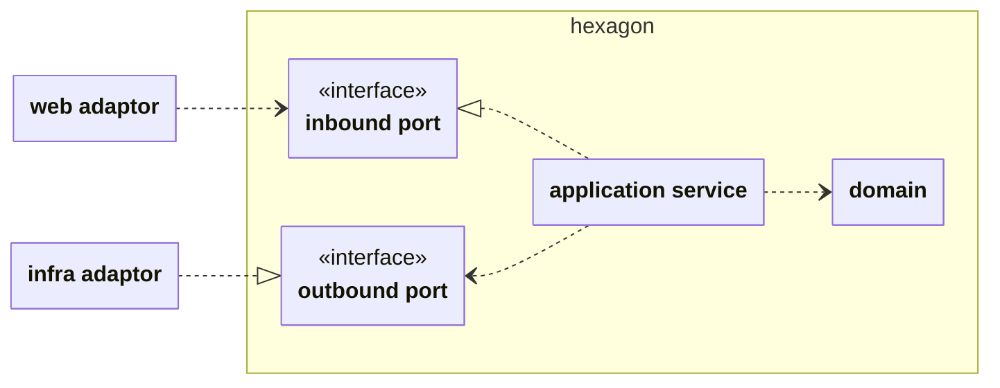

### 요구사항 및 기능목록

- [x] 사용자는 웹 브라우저로 접속할 수 있다.
- [x] 키워드(제목, 저자 등)으로 책을 검색할 수 있다.
- [x] 책 상세보기할 수 있다.
- [x] 책 상세보기 페이지에서 다른 사람의 독후감(북톡)을 볼 수 있다.
- [x] 독후감(북톡)은 250자이내로 작성할 수 있다.
- [x] 북톡에 리액션이 가능하다. 좋아요, 공감해요
- [ ] 기본적으로 1년이 지난 북톡은 비공개된다.
- [x] 따로 로그인 하지 않아도 북톡을 작성할 수 있다.
    - [ ] 비 로그인 북톡은 1년후 숨김처리된다.
    - [ ] 수정/삭제 가능하지만 재접속 후에는 불가(로그인시에는 가능)

- 톡의 대상은 작가 - 작품 - 개별 도서로 분류된다.
  - 사용자는 작가에 작성할 수 있다. "헤르만 헤세"
  - 또한 사용자는 작가의 작품에 톡을 작성할 수 있다. 예를 들어 "헤르만 헤세의 데미안"
  - 또한 사용자는 특정 출판사의 출간 도서에 톡을 작성할 수 있다. 예를 들어 "민음사가 출간한 헤르만 헤세의 데미안"에 작성 가능 

- 톡의 작성 대상이 될 수 있는 것은 `주제` 라고 부르며 각 주제는 상위 또는 하위 주제와 사용상에 있어서 연결되어 표현된다.
  - 예를 들어 "데미안" 라는 작품 주제를 조회하면 연관된 상위 주제인 작가 "헤르만 헤세" 와 연관관 하위 주제인 각 출판 도서 "민음사에서 출판한 데미안", "열린책들에서 출판한 데미안" 주제를 함께 보여준다.
  - "데미안" 라는 작품 주제를 조회하면 해당 주제의 톡 외에 하위 출판도서 주제에서 작성된 톡을 묶은 집계된 톡을 함께 표시한다.
  - "데미안" 라는 작품 주제를 조회하면 해당 주제의 톡 외에 상위 작가 주제에서 작성된 톡을 일부 랜덤하게 보여준다.

### 비기능 목록
- HTTPS, 사용자 친화적 도메인주소로 접속가능하게 한다
- 추천 북톡 등 빈번한 조회 API의 응답성을 높인다 : 캐시전략 등
- 외부 도서 API를 사용하여 통합한다 : 네이버
- 모바일 접근성을 고려한 UI를 구현한다
- 확장성이 좋은 소프트웨어 구조를 사용한다 : 헥사고날 아키텍쳐

- 외부 공격을 막는 수단을 구축한다 
  - 가용성 : 초당 API 제한

### 도메인

- 책 Book : ISBN, 제목, 출판사, 저자, 작성자의 속성을 가진다.
- 멤버 Member : 접속한 유저를 통칭. 게스트, 정회원, 어드민으로 나뉜다.
- 북톡 Talk : 250자이내로 작성, 숨김시간을 가진다.
- 리액션 Reaction : 북톡에대한 리액션이 가능하다. 좋아요, 공감해요
- 자동 숨김 Self Hidden : 기본적으로 1년이 지나면 글은 자동으로 숨김된다.

---
  

  

### 애플리케이션 아키텍쳐 (Hexagonal Architecture)

